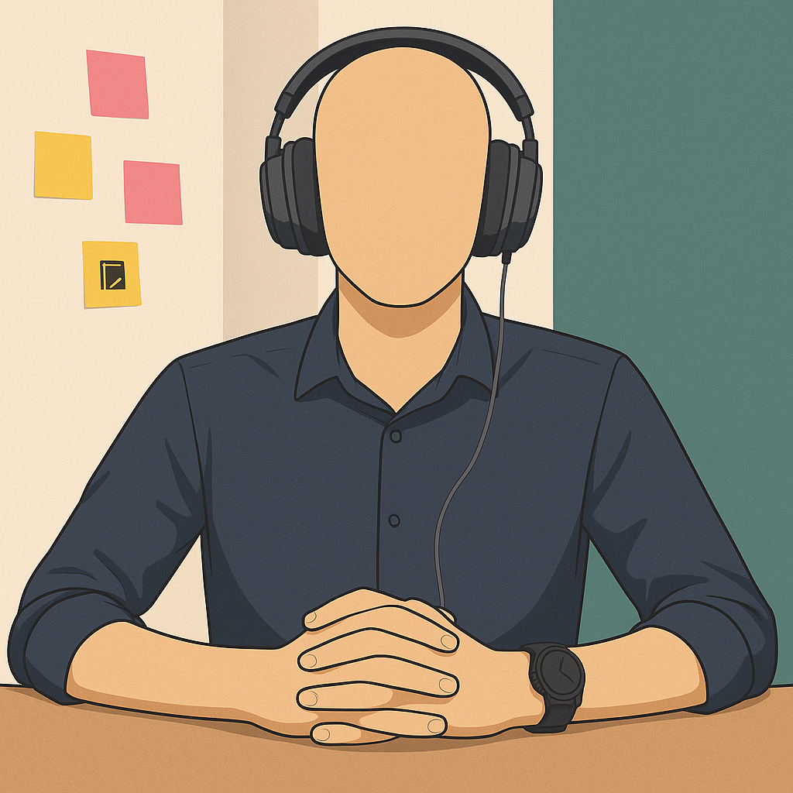
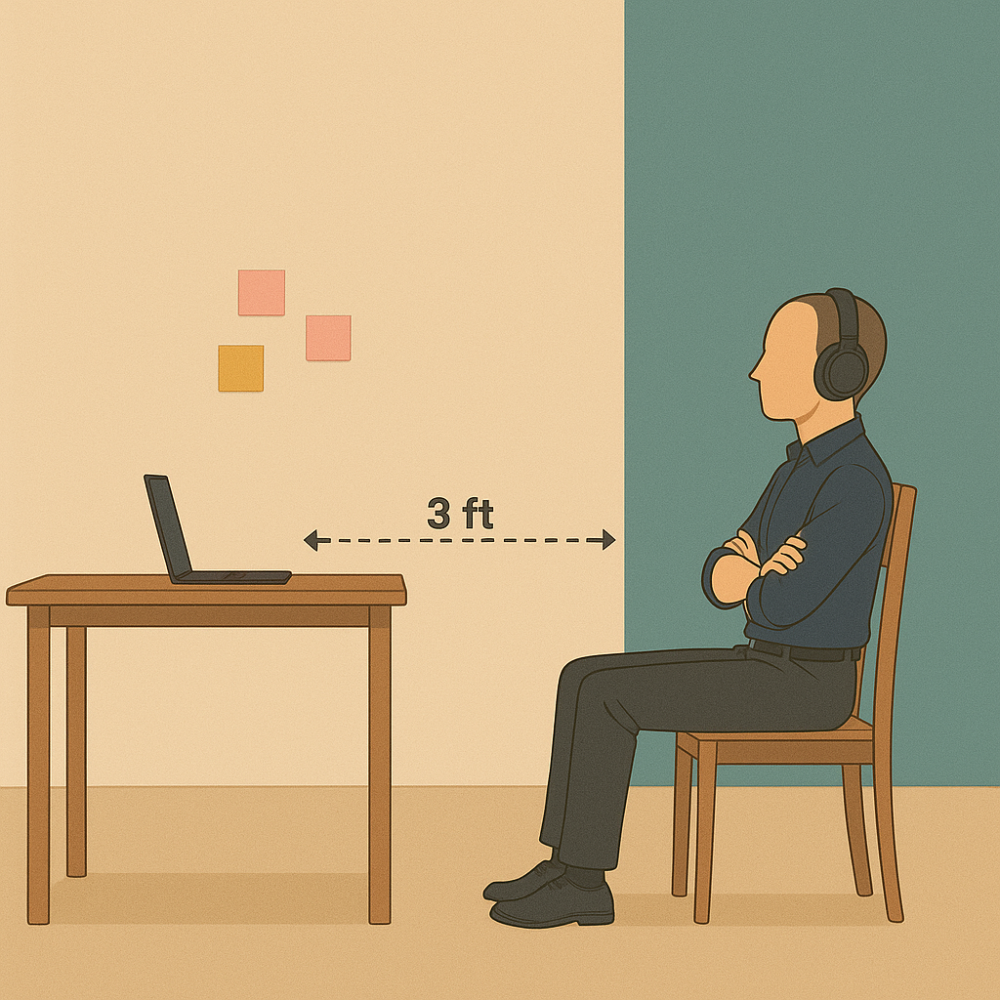
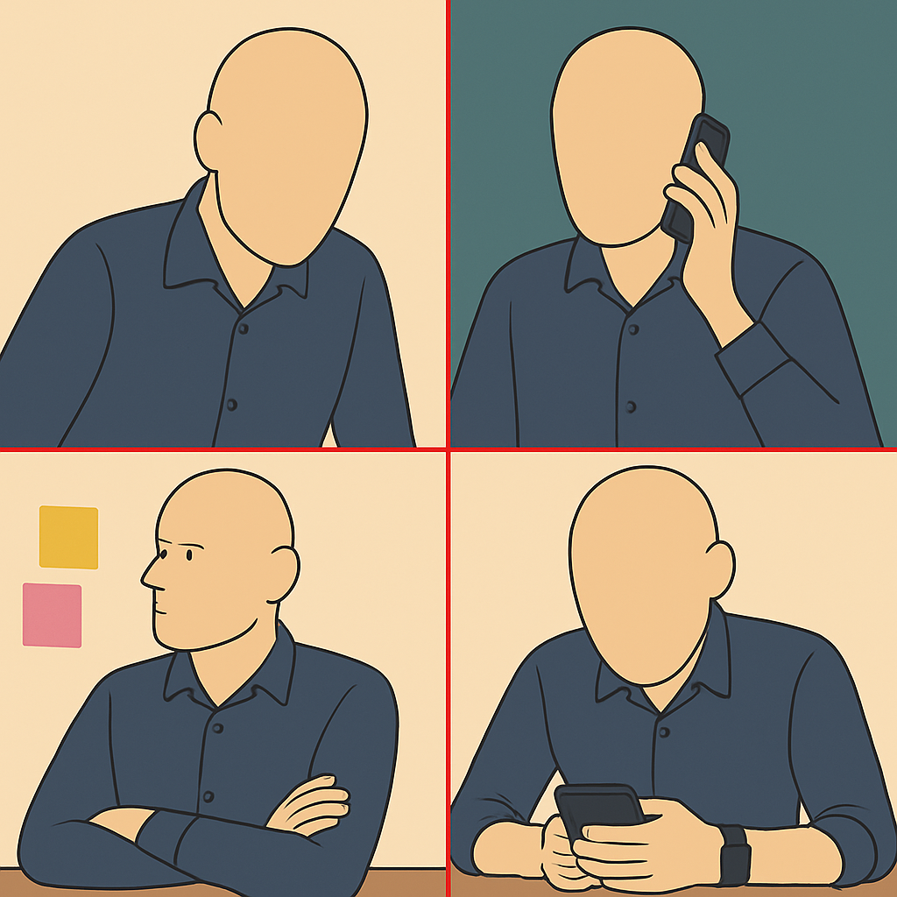

# How to Prepare for Your Interview

We're excited to have you interview with us! To ensure a smooth and successful experience on the Recruit41 platform, please carefully review this guide.

!!! info "Quick Overview"
    This guide will help you prepare for your AI-powered interview with Kiran, our virtual interviewer. Following these guidelines will ensure a fair and effective evaluation of your skills.

## Before Your Interview

### Use Google Chrome Browser
- Our platform is optimized for the official Google Chrome browser.
!!! warning "Supported Browser"
    For the best experience, please use **Google Chrome**. Other browsers (Chromium-based browsers like Brave and Arc, Safari, Microsoft Edge, and mobile browsers) are currently not supported.

!!! warning "Supported Operating Systems"
    The Recruit41 platform is designed for desktop and laptop computers running **Windows, macOS, or Linux**. For the best experience, please use a desktop or laptop.

!!! warning "Personal Laptops Recommended"
    Most corporate laptops are configured with firewalls and proxy settings that can interfere with the Recruit41 platform. This may cause issues during your interview and could impact your score.

Please use a personal desktop or laptop computer for your interview. Attempting to join from a mobile device may result in technical issues.

### Check your Camera and Microphone
- **Working Equipment**: Ensure your camera and microphone are functioning correctly. Bluetooth headphones/earphones are recommended if available.

- **Bluetooth Users**: If using Bluetooth, set your devices as the default microphone and speaker in your operating system settings.

- **Test Your Setup**: Test your camera and microphone at [webcammictest.com](https://webcammictest.com) well before your interview.

### Prepare for Screen Sharing
- During the interview, you might be asked to share your screen.

!!! danger "Important"
    You must share your entire screen (not just a tab or window). This is crucial for us to evaluate any code you write. Without full screen sharing, we cannot grade your code.

### Familiarize Yourself with Our Platform
- Practice with a mock interview at [https://demo.recruit41.com/](https://demo.recruit41.com/). This will help you get comfortable with audio/video controls, screen sharing, and other platform features.

### Suitable Interview Environment
- **Quiet & Distraction-Free**: Choose a location where you won't be interrupted.
- **Good Lighting**: Sit facing a light source so your face is clearly visible.
- **Minimize Background Noise**: Ensure a quiet setting for clear audio.

---

## During Your Interview

### Positioning the Camera
- **Clear View**: Your entire upper body (including face, arms, and hands) must be clearly visible to the interviewer.
- **Distance**: This typically means sitting approximately 3 feet or more away from your computer screen.
- **Pen & Paper**: You may use pen and paper, but ensure your hands, pen, and paper remain visible.
- **Exception for Coding**: When asked to write code, you may move closer to the screen.

!!! tip "Positioning Guide"

    **Correct Position**

    { width="45%" }
    { width="45%" }

    Sitting at a proper distance, hands visible.

    ---

    **Incorrect Position**

    { width="70%" }

    Sitting too close, hands not visible, using your mobile phone, looking away during the interview and not wearing headphones.

### Interacting with Kiran, your AI Interviewer

- **Thoughtful Responses**: Respond with a few complete sentences rather than 1-2 word answers. This helps Kiran (and any human reviewers) understand your thought process.
- **If Kiran seems stuck**: If Kiran appears unresponsive, prompt it by saying, "Hey Kiran, are you there?"

### Communication Etiquette
- **Listen Actively**: Allow the interviewer to finish speaking before you respond.
- **Wait Your Turn**: Let the interviewer complete their question before responding.

### Meeting Controls
- **Keep Your Tab Open**: Stay on the interview tab throughout your session. If you need to stop, use the "End Meeting" button on the control panel.
- **Pausing/Ending**: If you need to stop or pause, use the "End Meeting" button located on the bottom control panel.

### Getting Support
- **Live Chat (Recommended)**: Reach our live support team via the chat option available on the bottom control panel for the fastest response.
- **Email**: Alternatively, you can email us at [support@recruit41.com](mailto:support@recruit41.com).

---

## Understanding Your Interview Type

Your interview experience will depend on the specific type of assessment you'll be taking. Please read the section that applies to your interview:

### Conversational Interviews

**What to Expect:**

- This will be a conversational interview with Kiran, our AI interviewer
- _No questions will appear on your screen_ - the interviewer will speak to you directly
- You'll have a natural conversation, just like talking to a human interviewer
- The AI interviewer will ask follow-up questions based on your responses
- Questions will be asked verbally, and you should respond by speaking naturally

**How It Works:**

1. Kiran will introduce themselves when you join
2. Questions will be asked through audio only
3. You respond naturally by speaking (no typing required)
4. The interview flows like a normal conversation
5. Kiran may ask clarifying questions based on your answers

### Coding Interviews

**What to Expect:**

- This is a coding interview where you'll solve programming problems
- _Only coding problems will appear on your screen_
- You'll need to share your screen and use your own code editor/IDE
- The AI interviewer may ask you to explain your approach verbally
- You'll write and run code in your local environment

**How It Works:**

1. Programming problems will be displayed on screen
2. You'll share your screen and use your preferred code editor/IDE
3. You'll write and test your solutions in your local environment
4. Kiran may ask you to explain your thinking process
5. Screen sharing is required throughout the coding portion

### Conversational + Coding Interviews

**What to Expect:**

- This interview combines both conversational and coding components
- The interview will start with conversational questions (no screen content)
- Later, coding problems will appear on your screen for the coding portion
- You'll need to be prepared for both spoken responses and screen sharing
- Kiran will guide you through the transition between interview types

**How It Works:**

1. Interview begins with conversational questions (audio only)
2. Kiran will inform you when transitioning to the coding portion
3. Coding problems will then appear on your screen
4. You'll share your screen and use your preferred code editor/IDE
5. You may need to explain both your conversational responses and coding approach

!!! tip "Not Sure Which Type?"
    If you're unsure about your interview type, check your invitation email or contact our support team. The interview format will be clearly indicated in your scheduling information.

---

## Frequently Asked Questions (FAQs)

??? question "No one seems to be talking in my interview - what should I do?"

    1. Wait 10-15 seconds after joining for Kiran to start speaking
    2. If still silent, try saying "Hey Kiran, are you there?"
    3. Check that your audio is working - you should hear Kiran speak
    4. Ensure your microphone isn't muted
    5. If problems persist, disconnect and rejoin the interview

??? question "I expected to see questions on screen but there aren't any"
    This is normal for conversational interviews! Questions are asked verbally only in a conversational interview. Listen carefully to Kiran and respond by speaking - no reading or typing required.

??? question "Coding problems aren't loading on my screen"

    1. Ensure you're using Google Chrome browser
    2. Refresh the page and rejoin if problems don't appear
    3. Check your internet connection
    4. Contact support via live chat if issues persist

??? question "I can't share my screen properly"
    1. Ensure you're sharing your entire screen (not just a window or tab)
    2. Check that screen sharing permissions are granted to your browser
    3. Make sure your code editor/IDE is visible and ready to use
    4. Use the live chat support if screen sharing issues persist

??? question "My local development environment isn't working"
    1. Test your code editor/IDE before the interview starts
    2. Ensure you have the necessary compilers/interpreters installed
    3. Have a backup code editor ready (like VS Code, Notepad++, etc.)
    4. Contact support if you need help with environment setup

??? question "The AI interviewer asks: 'Are you there?' while I am answering the question. What should I do?"
    This usually means the AI cannot hear you. Please:

    1. Check if your audio is muted.
    2. Ensure you've granted microphone and camera permissions to the browser.
    3. Confirm the correct microphone is selected as default in your operating system.
    4. Test your setup at [webcammictest.com](https://webcammictest.com)

??? question "I faced some platform-related issues during my interview. Will it affect my application?"
    No, any platform-related errors will not negatively impact your application.

??? question "What should I do if I get disconnected during the interview?"
    You can rejoin the same interview and continue from where you left off, provided it's within the stipulated time period.

??? question "My camera isn't being detected or is showing a blank screen. What should I do?"
    Ensure you select the correct camera source on the pre-meeting page before starting the interview.

??? question "Is it necessary to keep my camera turned on throughout the interview?"
    Yes, to ensure a fair evaluation, your camera must remain switched on for the entire process.
