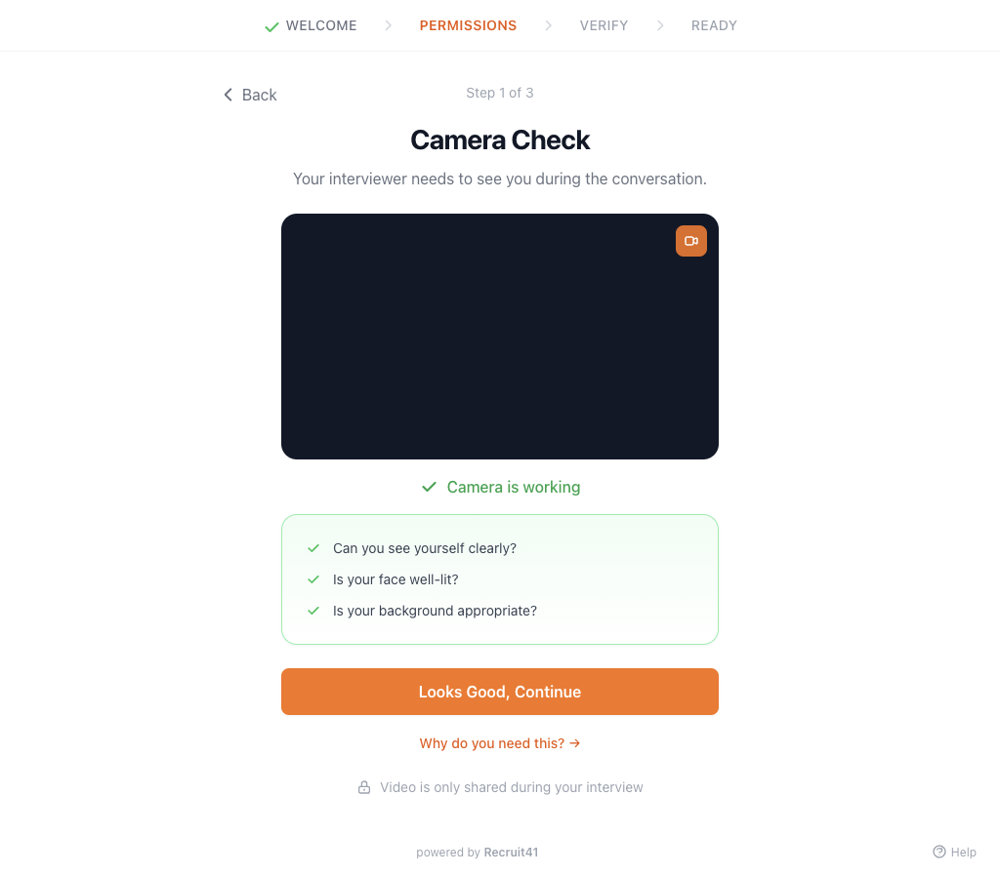

# Lockdown Browser — What Recruiters Need to Know

The Recruit41 Desktop App (Lockdown Browser) creates a secure environment for candidate interviews. This page explains how the app works, what candidates go through during setup, and how to troubleshoot common issues they may report.

!!! tip
    The candidate setup takes about 2 minutes. If a candidate reports issues, this page covers every step they see.

## How It Works

When you enable the Lockdown Browser for an opening, candidates are required to download and install the Recruit41 Desktop App before starting their interview. The app:

- **Prevents tab/app switching** during the interview
- **Detects prohibited applications** (remote desktop tools, AI assistants)
- **Verifies single display** (external monitors must be disconnected)
- **Monitors camera and microphone** access throughout the session

---

## What Candidates See

### Download & Install Flow

When a candidate opens their interview link and the Lockdown Browser is required, they see a **Desktop App Required** card with three steps:

  <video controls width="100%" poster="../../assets/images/lockdown-browser/01-welcome.png">
    <source src="../../assets/videos/lockdown-browser/lockdown-browser-guide.mp4" type="video/mp4">
    Your browser does not support the video tag.
  </video>
  

    <em>Quick guide video (shareable with candidates)</em>
  

**Step 1: Download** — The website auto-detects the candidate's OS and shows the correct installer:

- Mac (Apple Silicon) — M1, M2, M3, M4 chips
- Mac (Intel) — Older Intel-based Macs
- Windows — Windows 10 or later

**Step 2: Install**

??? note "macOS"
    1. Open the downloaded `.dmg` file
    2. Drag the **Recruit41** app to the **Applications** folder
    3. Open the app from Applications (may need to right-click → Open the first time)

??? note "Windows"
    1. Run the downloaded `.exe` installer
    2. Follow the installation wizard
    3. The app opens automatically after installation

**Step 3: Launch** — Candidate clicks **Launch Desktop App** on the website, which opens the app and passes their interview credentials securely.

---

### Setup Walkthrough (What the Candidate Sees)

After launching, the candidate goes through these screens:

#### 1. Welcome Screen

Confirms the setup takes about 2 minutes and that camera/microphone will be tested.

#### 2. Privacy & Monitoring Consent

The candidate is informed about what the app monitors:

| What's Monitored | Details |
| :--- | :--- |
| **Screen activity** | Checks for prohibited apps (does not record screen content) |
| **Camera & Microphone** | Video/audio shared only during interview |
| **Running processes** | Checked against a blocklist (no file access) |

The candidate must check a consent box and click **I Agree & Continue** to proceed.

#### 3. Camera Check

The app verifies the camera is working and the candidate is properly framed.

#### 4. Microphone Check

The candidate speaks and watches audio level bars respond. They can select a different microphone from the dropdown if needed.

#### 5. Screen Recording Permission (macOS only)

Mac users need to grant screen recording permission in System Settings. Windows users skip this step.

#### 6. Final System Check

The app verifies all requirements:

- Camera access
- Microphone access
- Screen recording enabled (macOS)
- No prohibited apps running
- Single display confirmed

#### 7. Ready to Start

All checks passed. The candidate clicks **Start Interview** to enter secure mode.

!!! danger "Secure Mode"
    Once started, the app keeps the candidate's screen focused on the interview until it's complete. They cannot switch apps or open other windows.

---

## Troubleshooting Candidate Issues

| Issue Reported | How to Advise |
| :--- | :--- |
| **Camera not working** | Close other apps using the camera (Zoom, FaceTime). Grant camera permission in System Settings → Privacy & Security → Camera. |
| **Microphone not detected** | Check it's plugged in, select correct mic from dropdown, grant permission in System Settings. |
| **"Prohibited app detected"** | Close: TeamViewer, AnyDesk, RustDesk, Cluly, Interview Coder, Control Potato, or similar tools. |
| **App won't launch from website** | Ensure app is installed first. Try clicking Launch again. Open manually from Applications if needed. |
| **Multiple displays detected** | Disconnect external monitors. The app requires a single display. |
| **Screen recording permission (Mac)** | Open System Settings → Privacy & Security → Screen Recording → Enable Recruit41. |

---

## Privacy & Security Summary

Share these points with candidates if they have privacy concerns:

- Camera and microphone are only active **during the interview**
- Screen activity is monitored for prohibited apps only — **screen content is not recorded**
- Running process names are checked against a blocklist — **no file access**
- All monitoring stops immediately when the interview ends
- Data is retained per the [privacy policy](https://recruit41.com/privacy)
