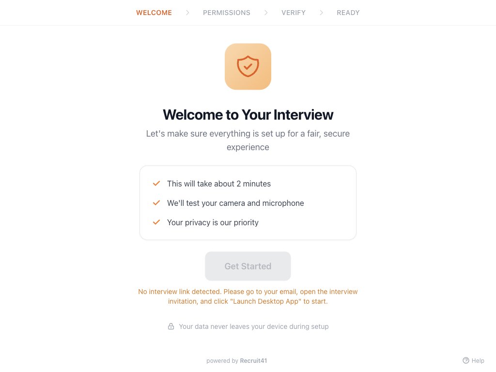
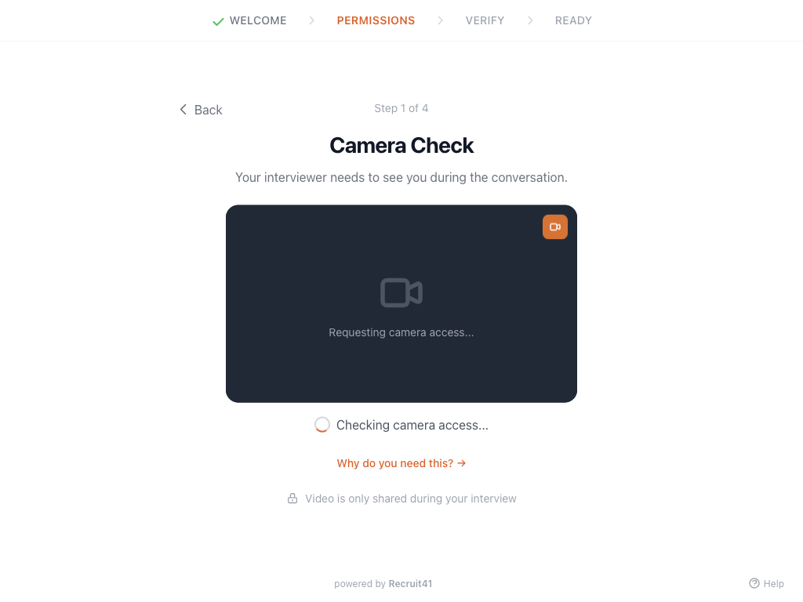
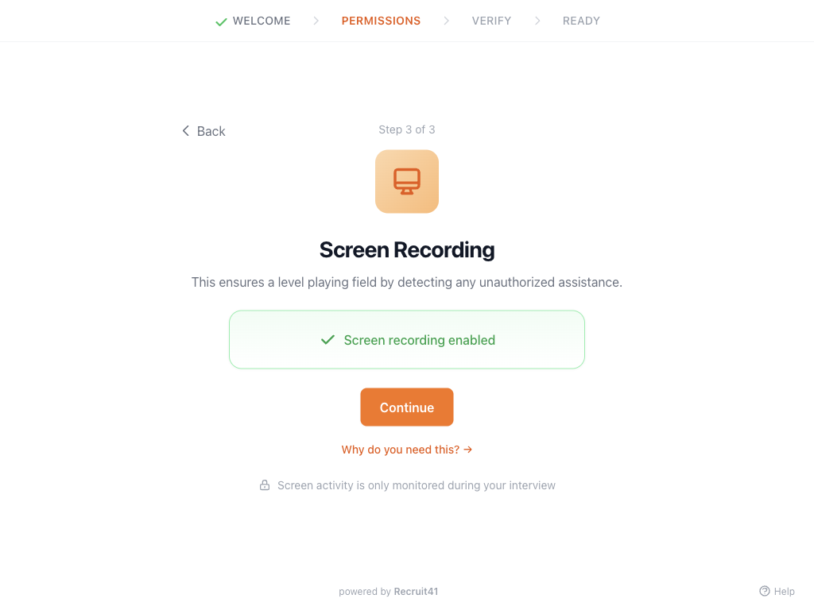
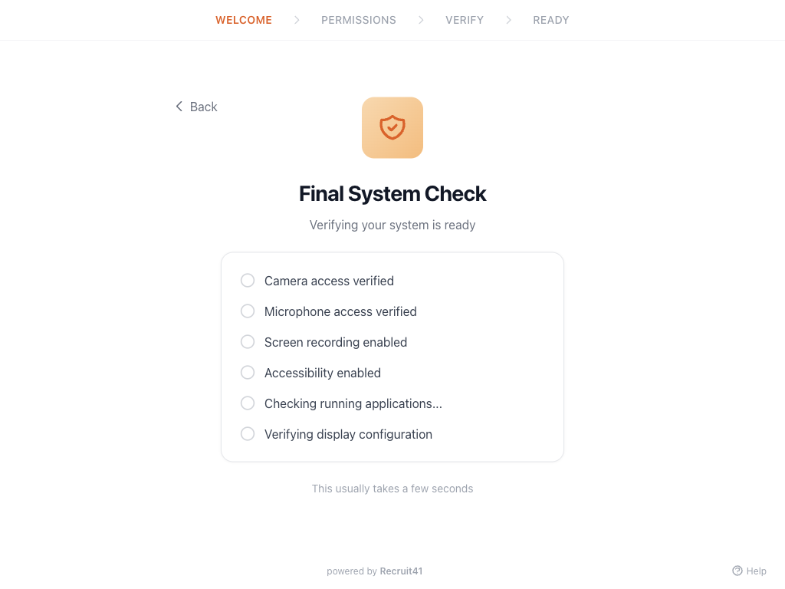
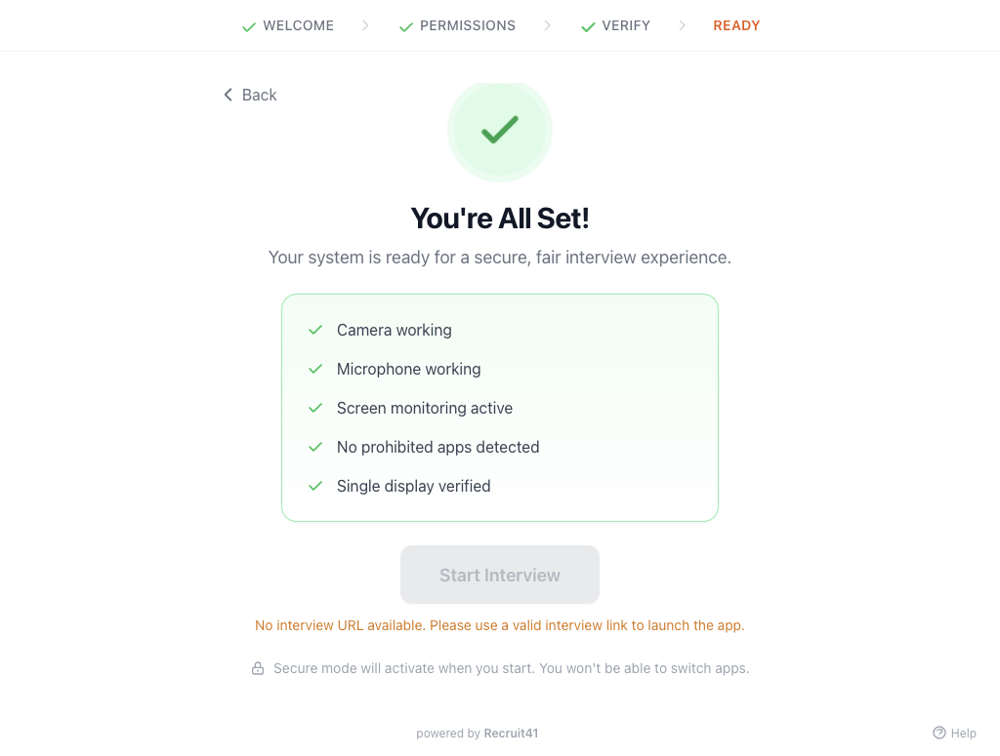

# Recruit41 Lockdown Browser - Help Guide

Welcome to the Recruit41 Lockdown Browser! This guide will walk you through the setup process and answer common questions about using the application for your AI-powered interview.

---

## Table of Contents

1. [Overview](#overview)
2. [System Requirements](#system-requirements)
3. [Getting Started](#getting-started)
4. [Step-by-Step Setup](#step-by-step-setup)
   - [Welcome Screen](#1-welcome-screen)
   - [Camera Check](#2-camera-check)
   - [Microphone Check](#3-microphone-check)
   - [Screen Recording Permission (macOS)](#4-screen-recording-permission-macos-only)
   - [Accessibility Permission (macOS)](#5-accessibility-permission-macos-only)
   - [System Check](#6-system-check)
   - [Ready Screen](#7-ready-screen)
5. [During Your Interview](#during-your-interview)
6. [Troubleshooting](#troubleshooting)
7. [Privacy & Security](#privacy--security)
8. [FAQ](#frequently-asked-questions)

---

## Overview

The Recruit41 Lockdown Browser creates a secure, fair environment for your AI-powered video interview. It ensures all candidates have the same experience by:

- Verifying your camera and microphone work properly
- Ensuring a single-monitor setup
- Checking that no prohibited applications are running
- Creating a focused interview environment (kiosk mode)

**The setup process takes approximately 2 minutes.**

  <video controls width="100%" poster="../../assets/images/lockdown-browser/01-welcome.png">
    <source src="../../assets/videos/lockdown-browser/lockdown-browser-guide.mp4" type="video/mp4">
    Your browser does not support the video tag.
  </video>
  

    <em>Watch the quick guide</em>
  

---

## System Requirements

### Minimum Requirements

| Component | macOS | Windows |
|-----------|-------|---------|
| **OS Version** | macOS 11 (Big Sur) or later | Windows 10 (1903) or later |
| **RAM** | 4 GB | 4 GB |
| **Camera** | Built-in or external webcam | Built-in or external webcam |
| **Microphone** | Built-in or external microphone | Built-in or external microphone |
| **Display** | Single monitor required | Single monitor required |
| **Internet** | Stable broadband connection | Stable broadband connection |

### Before You Begin

1. **Close unnecessary applications** - especially screen sharing tools, chat apps, and any overlay software
2. **Use a single monitor** - disconnect any external displays
3. **Ensure good lighting** - face a light source, avoid backlighting
4. **Find a quiet space** - minimize background noise
5. **Have your interview invitation email ready**

---

## Getting Started

### How to Launch the App

1. Open your interview invitation email from Recruit41
2. Click the **"Launch Desktop App"** button in the email
3. The Recruit41 Lockdown Browser will open automatically
4. Follow the on-screen setup wizard

!!! note
    If the app doesn't open automatically, you may need to download and install it first from the link provided in your email.

---

## Step-by-Step Setup

### 1. Welcome Screen

When you first launch the app, you'll see the **Welcome Screen**. This screen:

- Explains what to expect during setup
- Shows the interview preparation takes about 2 minutes
- Confirms your privacy is protected

**What to do:**
- Read the checklist to understand the process
- Click **"Get Started"** to begin the setup

!!! warning "Important"
    If you see "No interview link detected," return to your email and click the "Launch Desktop App" button again.

---

### 2. Camera Check

The **Camera Check** ensures your webcam is working properly.

**What happens:**
- The app requests camera permission
- You'll see a live preview of your video feed
- A quality checklist helps you verify the setup

**Tips for best results:**
- Position your face in the center of the frame
- Ensure good lighting (face a window or light source)
- Keep a neutral, professional background
- Sit at arm's length from the camera

**If camera access is denied:**
1. Click **"Open System Settings"**
2. Navigate to Privacy & Security > Camera
3. Enable camera access for Recruit41
4. Return to the app and try again

---

### 3. Microphone Check

The **Microphone Check** verifies your audio input is working.

**What happens:**
- The app requests microphone permission
- You'll see a live audio level meter
- The meter shows green bars when it detects your voice

**How to test:**
1. Select your preferred microphone from the dropdown
2. Say something like "Hello, this is a test"
3. Watch the audio level bar - it should move as you speak
4. Once audio is detected, the app advances automatically

**Troubleshooting microphone issues:**
- Make sure you're not muted
- Check that the correct microphone is selected
- Speak clearly at a normal volume
- Ensure no other app is using the microphone

---

### 4. Screen Recording Permission (macOS Only)

!!! note
    This step only appears on macOS. Windows users skip to System Check.

The **Screen Recording** permission allows the app to monitor your display during the interview. This ensures a level playing field by detecting any unauthorized assistance.

**Why is this needed?**
- Ensures no cheating tools are visible on screen
- Verifies you're focused on the interview
- Creates fairness for all candidates

**How to enable:**
1. Click **"Open System Settings"**
2. Navigate to: **Privacy & Security > Screen Recording**
3. Toggle **ON** for Recruit41
4. Return to the app and click **"Continue"**

!!! info "Privacy"
    Screen activity is only monitored during your interview, not during setup.

---

### 5. Accessibility Permission (macOS Only)

!!! note
    This step only appears on macOS. Windows users skip to System Check.

The **Accessibility** permission allows the app to detect certain keyboard shortcuts that could be used to access external help.

**Why is this needed?**
- Detects screenshot shortcuts (Cmd+Shift+3/4/5)
- Detects app-switching shortcuts (Cmd+Tab)
- Ensures interview integrity

**How to enable:**
1. Click **"Open System Settings"**
2. Navigate to: **Privacy & Security > Accessibility**
3. Toggle **ON** for Recruit41
4. Return to the app and click **"Continue"**

!!! info "Privacy"
    The app only monitors specific keyboard shortcuts, not your typing or keystrokes.

---

### 6. System Check

The **System Check** verifies all requirements are met before your interview.

**Checks performed:**
1. **Camera access verified** - Your webcam is working
2. **Microphone access verified** - Your audio input is working
3. **Screen recording enabled** - (macOS) Display monitoring is active
4. **Accessibility enabled** - (macOS) Keyboard monitoring is active
5. **Checking running applications** - No prohibited apps detected
6. **Verifying display configuration** - Single monitor confirmed

**What if a check fails?**
- The app will show which check failed
- Follow the on-screen instructions to resolve
- You may be redirected to a specific setup screen

**Prohibited applications include:**
- AI assistants (Interview Coder, Cluly, Control Potato)
- Remote desktop tools (TeamViewer, AnyDesk, RustDesk)
- These must be closed before you can proceed

---

### 7. Ready Screen

Congratulations! The **Ready Screen** confirms your system is fully prepared.

**Summary of verified items:**
- Camera working
- Microphone working
- Screen monitoring active
- Keyboard monitoring active (macOS)
- No prohibited apps detected
- Single display verified

**Before clicking "Start Interview":**
- Take a deep breath and relax
- Review your notes one last time (you won't be able to access them during the interview)
- Ensure you have water nearby if needed

**Click "Start Interview"** to begin!

!!! warning "Important"
    Once you start, the app enters "secure mode" - you won't be able to switch to other applications until the interview is complete.

---

## During Your Interview

### What to Expect

- The app will enter **full-screen kiosk mode**
- You'll see the AI interviewer interface
- Your video and audio will be shared with the interviewer
- The session is monitored for fairness

### What's Monitored

| Activity | Purpose |
|----------|---------|
| Camera feed | AI interviewer needs to see you |
| Microphone audio | AI interviewer needs to hear you |
| Screen content | Ensures no cheating tools are visible |
| Running processes | Detects prohibited applications |
| Display setup | Ensures single-monitor use |

### What's NOT Monitored

- Your keystrokes or typing (only specific shortcuts are detected)
- Your browsing history
- Other applications when the interview is not active
- Any activity before or after the interview

### Tips for Success

1. **Speak clearly** - The AI interviewer processes your audio
2. **Look at the camera** - Maintain virtual eye contact
3. **Take your time** - Think before responding
4. **Be yourself** - Answer authentically
5. **Stay focused** - Avoid looking away from the screen

---

## Troubleshooting

### Camera Not Working

**Symptoms:** Black screen, "Camera access denied" message

**Solutions:**
1. Check if another app is using the camera (close Zoom, Teams, etc.)
2. Verify camera permissions in System Settings:
   - **macOS:** System Settings > Privacy & Security > Camera
   - **Windows:** Settings > Privacy > Camera
3. Try selecting a different camera from the dropdown
4. Restart the app
5. Restart your computer if the issue persists

### Microphone Not Working

**Symptoms:** Audio level meter doesn't respond, "No audio detected"

**Solutions:**
1. Check if you're muted (system-level or hardware mute)
2. Select the correct microphone from the dropdown
3. Check microphone permissions:
   - **macOS:** System Settings > Privacy & Security > Microphone
   - **Windows:** Settings > Privacy > Microphone
4. Test your microphone in another app (Voice Memos, Sound Recorder)
5. Check if another app has exclusive microphone access

### Permission Denied

**Symptoms:** "Permission denied" error, unable to proceed

**macOS Solutions:**
1. Go to **System Settings > Privacy & Security**
2. Find the relevant permission (Camera/Microphone/Screen Recording/Accessibility)
3. Toggle OFF then ON for Recruit41
4. You may need to quit and restart the app
5. If the app doesn't appear in the list, try reinstalling

**Windows Solutions:**
1. Go to **Settings > Privacy**
2. Select Camera or Microphone
3. Ensure "Allow apps to access your [device]" is ON
4. Scroll down and ensure Recruit41 has access

### Multiple Monitors Detected

**Symptoms:** "Multiple displays detected" error

**Solutions:**
1. Disconnect all external monitors
2. If using a laptop with a closed lid + external display, open the laptop lid
3. Use only one display for the interview
4. After disconnecting, wait a few seconds for the app to detect the change

### Prohibited Application Detected

**Symptoms:** "Close [app name] to continue"

**Solutions:**
1. Check the app name shown in the error
2. Quit the application completely (not just minimize)
3. On macOS: Right-click the dock icon and select "Quit"
4. On Windows: Check the system tray for hidden running apps
5. Use Activity Monitor (macOS) or Task Manager (Windows) if the app doesn't quit normally

### App Won't Start

**Symptoms:** App crashes, doesn't open, or shows blank screen

**Solutions:**
1. Restart the application
2. Restart your computer
3. Reinstall the app from the link in your invitation email
4. Check for system updates
5. Contact support with your error ID if available

---

## Privacy & Security

### What Data Is Collected

| Data Type | When Collected | Purpose |
|-----------|---------------|---------|
| Video feed | During interview only | For AI interviewer interaction |
| Audio | During interview only | For AI interviewer to hear responses |
| Screen activity | During interview only | To ensure interview integrity |
| Process list | During system check & interview | To detect prohibited applications |
| Permission status | During setup | To verify requirements are met |

### What Data Is NOT Collected

- Keystroke logging (only specific shortcuts are detected)
- Files on your computer
- Browsing history
- Personal documents
- Activity outside the interview

### Data Handling

- Video and audio are processed by the AI interviewer in real-time
- Session data is encrypted in transit
- No data is stored on your local device
- See Recruit41's full privacy policy for data retention details

### Security Measures

- All communication uses HTTPS/TLS encryption
- The app runs in a sandboxed environment
- No third-party tracking or analytics during the interview
- The app cannot access your files or personal data

---

## Frequently Asked Questions

### General Questions

**Q: Why do I need a special app for the interview?**
A: The Lockdown Browser ensures a fair experience for all candidates by creating a controlled environment, similar to a proctored exam. This prevents any unfair advantages.

**Q: Can I use the app on a tablet or phone?**
A: No, the Lockdown Browser is only available for macOS and Windows desktop/laptop computers.

**Q: What if my internet connection drops during the interview?**
A: The app will attempt to reconnect automatically. If the connection cannot be restored, contact support with the details from your invitation email.

**Q: Can I pause or reschedule the interview once started?**
A: Once the interview begins, it should be completed in one session. Contact the hiring company if you need to reschedule.

### Technical Questions

**Q: Why does the app need so many permissions?**
A: Each permission serves a specific purpose:
- **Camera:** For the AI interviewer to see you
- **Microphone:** For the AI interviewer to hear you
- **Screen Recording (macOS):** To ensure no cheating tools are visible
- **Accessibility (macOS):** To detect specific keyboard shortcuts that could access help

**Q: Is my webcam feed recorded?**
A: The video is processed by the AI interviewer for the interview interaction. Check Recruit41's privacy policy for specific recording and retention details.

**Q: Why can't I use multiple monitors?**
A: Multiple monitors could allow viewing unauthorized materials off-camera. A single monitor ensures the interview content is the only thing visible.

**Q: What applications are prohibited?**
A: Prohibited applications include:
- AI coding assistants (Interview Coder, Cluly, Control Potato)
- Remote desktop tools (TeamViewer, AnyDesk, RustDesk)
- Screen sharing tools that could provide unauthorized assistance

**Q: Can I have other apps open in the background?**
A: Non-prohibited apps can remain open, but you won't be able to switch to them during the interview. Some apps (Discord, Skype, Telegram) are monitored but not blocked.

### Account & Access Questions

**Q: I lost my interview invitation email. What do I do?**
A: Contact the company that invited you for a new interview link, or check your spam/junk folder.

**Q: The "Get Started" button is grayed out. Why?**
A: This means no interview link was detected. Make sure you opened the app from the link in your invitation email. If you launched the app directly, close it and use the email link instead.

**Q: I'm having trouble and need support. How do I get help?**
A: If you encounter an error, note the Error ID shown on screen. Contact the hiring company's recruiting team or Recruit41 support with this information.

---

## Need More Help?

If you're experiencing issues not covered in this guide:

1. **Note your Error ID** - If an error screen appears, copy the Error ID shown
2. **Check your email** - Your interview invitation may contain specific support contacts
3. **Contact the hiring company** - They can assist with interview-specific questions
4. **Visit Recruit41 Support** - For technical issues with the application

---

*Last updated: February 2026*
*Version: 1.0*
