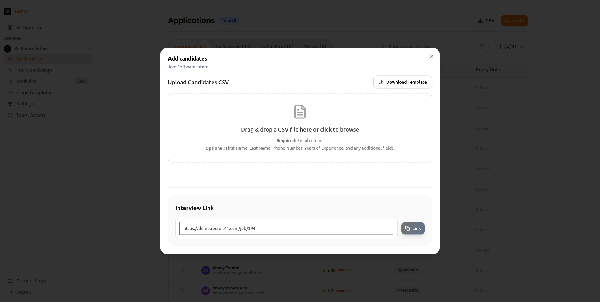
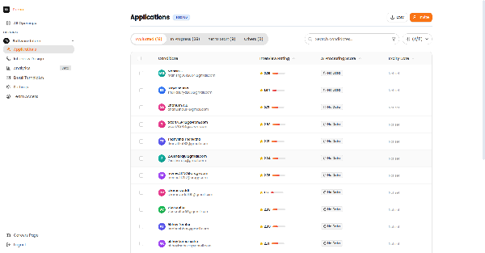
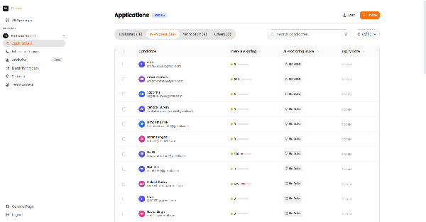
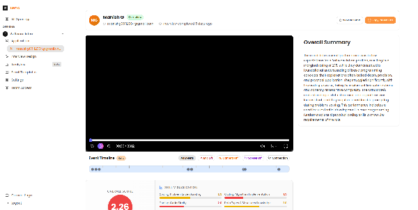
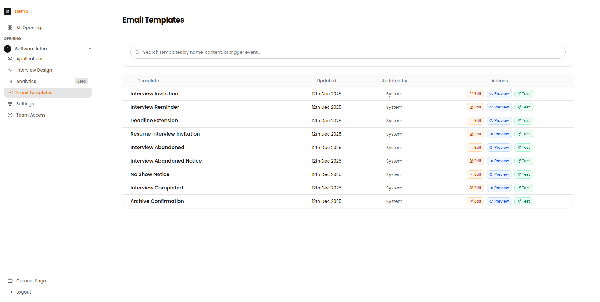

# Candidate Management

This guide covers how to invite candidates, manage applications, and review candidate profiles in Recruit41.

---

## Sourcing Methods

### Bulk Upload (CSV)

Upload multiple candidates at once using a CSV file.

*The Add Candidates modal with CSV upload zone and interview link.*

For detailed instructions on CSV uploads, see the [Candidate Invitations Guide](candidate-invitations.md).

---

## Applications Dashboard

The Applications page shows all candidates for a job, organized by their interview status.

*The Applications page showing evaluated candidates with their scores and status.*

### Status Tabs

| Tab | Description |
| :--- | :--- |
| **Invited** | Candidates who received an invitation but haven't started |
| **In Progress** | Candidates currently taking their interview |
| **Evaluated** | Completed interviews with AI-generated scores |
| **All** | View all candidates regardless of status |

*The In Progress tab showing candidates currently taking their interviews.*

---

## Reviewing Candidate Profiles

Click on any candidate row to view their detailed profile:

*The candidate profile page showing video recording, overall score, skill visualization, and AI-generated summary.*

### Profile Components

| Section | Description |
| :--- | :--- |
| **Video Recording** | Full interview playback |
| **Overall Score** | Composite score across all criteria |
| **Skill Visualization** | Radar chart of competency scores |
| **AI Summary** | Automated analysis of strengths and areas for improvement |
| **Detailed Feedback** | Section-by-section breakdown |

!!! tip "Efficient Review"
    Use the AI summary for initial screening, then watch key moments in the video for candidates you're considering advancing.

---

## Communication Templates

Recruit41 provides pre-built email templates for candidate communication.

*The Email Templates page showing available templates for different stages of the candidate journey.*

For ready-to-use templates, see the [Email Templates Guide](email-templates.md).

---

## Related Guides

- [Candidate Invitations](candidate-invitations.md) - Detailed CSV upload instructions
- [Email Templates](email-templates.md) - Professional communication templates
