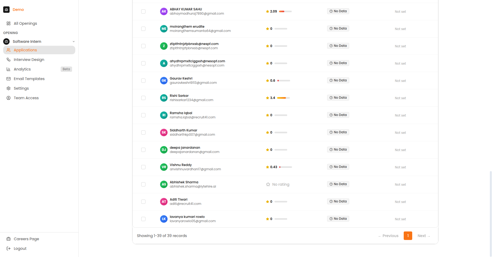

# Candidate Management

This section covers how to source candidates, manage applications in bulk, customize communications, and efficiently screen candidates.

---

## Sourcing Methods

### Option A: Individual Candidate (Direct Link)

1. Go to your job in the ATS
2. Click **"Add Candidates"** in the sidebar
3. Click **"Direct Link"** option
4. Copy the unique job/interview URL
5. Share via email, social media, or messaging

### Option B: Bulk Upload (CSV)

Upload multiple candidates at once using a CSV file.

| Column | Required? | Description |
| :--- | :--- | :--- |
| **Email** | Yes | Candidate's email address (must be unique) |
| **Name** | No | Full name of candidate |
| **Phone** | No | Phone number |
| **Experience** | No | Years of experience |
| **Resume Link** | No | URL to resume |
| **Notes** | No | Internal notes |

For detailed CSV upload instructions, see the [Candidate Invitations Guide](candidate-invitations.md).

### Applications Dashboard

The Applications page shows all candidates for a job, organized by their interview status.

*The Applications page showing evaluated candidates with their scores and status.*

### Understanding Candidate Status

| Status | Meaning | Action Needed? |
| :--- | :--- | :--- |
| **Invited** | Email sent, hasn't started | Wait or send reminder |
| **Started** | Began interview | Monitor progress |
| **In Progress** | Partially completed | May need follow-up |
| **Abandoned** | Stopped mid-interview | Consider re-engagement |
| **Completed** | Finished interview | Review results |
| **No Show** | Deadline passed, never started | Close or extend |

---

## Bulk Actions Panel

Select multiple candidates to perform batch operations:

| Action | Description |
| :--- | :--- |
| **Send Reminders** | Send reminder emails to selected candidates |
| **Change Status** | Update status in batch |
| **Export** | Download selected candidates as CSV |
| **Archive** | Move candidates to archived status |
| **Send Custom Email** | Send a custom message to all selected |

*The In Progress tab showing candidates currently taking their interviews.*

### How to Use Bulk Actions

1. Select candidates using the checkboxes
2. Click the **"Bulk Actions"** button in the toolbar
3. Choose the desired action
4. Confirm the action

---

## Communication Customisation

### Communication Templates

| Template | When to Use |
| :--- | :--- |
| **Reminder** | Nudge to complete interview |
| **Extension** | Grant more time |
| **Abandoned** | Re-engage dropped candidates |
| **Custom** | Write your own message |

### Customizing Templates

1. Go to **Email Templates** in the sidebar
2. Select the template to edit
3. Modify the subject line and body
4. Use placeholders for dynamic content:
   - `{{candidate_name}}` - Candidate's name
   - `{{job_title}}` - Position name
   - `{{deadline}}` - Interview deadline
   - `{{interview_link}}` - Unique interview URL

For ready-to-use templates, see the [Email Templates Guide](email-templates.md).

---

## Rapid Screening Tools

### Reviewing Candidate Profiles

Click on any candidate row to view their detailed profile:

*The candidate profile page showing video recording, overall score, and AI-generated summary.*

### Profile Components

| Section | Description |
| :--- | :--- |
| **Video Recording** | Full interview playback |
| **Overall Score** | Composite score across all criteria |
| **Skill Visualization** | Radar chart of competency scores |
| **AI Summary** | Automated analysis of strengths and areas for improvement |
| **Detailed Feedback** | Section-by-section breakdown |

*Full candidate profile with detailed scoring breakdown.*

!!! tip "Efficient Review"
    Use the AI summary for initial screening, then watch key moments in the video for candidates you're considering advancing.

### Filters

| Filter | Options |
| :--- | :--- |
| **Status** | Invited, In Progress, Completed, etc. |
| **Score Range** | Min/Max AI rating |
| **Date Applied** | Last 7 days, 30 days, custom |
| **Tags** | Custom tags you've applied |

### Sorting Options

| Sort By | Use When |
| :--- | :--- |
| **AI Rating** | Find top performers |
| **Date** | See newest/oldest |
| **Status** | Group by progress |
| **Name** | Alphabetical lookup |

### Score Interpretation

| Score | Meaning | Recommendation |
| :--- | :--- | :--- |
| **4.5 - 5.0** | Exceptional | Strong hire |
| **4.0 - 4.4** | Above average | Consider for next round |
| **3.5 - 3.9** | Meets expectations | Review carefully |
| **3.0 - 3.4** | Below average | Likely not a fit |
| **Below 3.0** | Does not meet | Do not advance |
