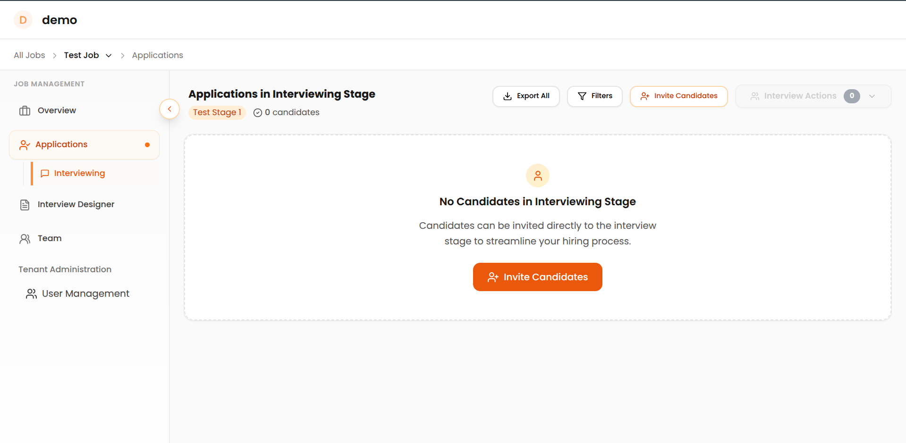
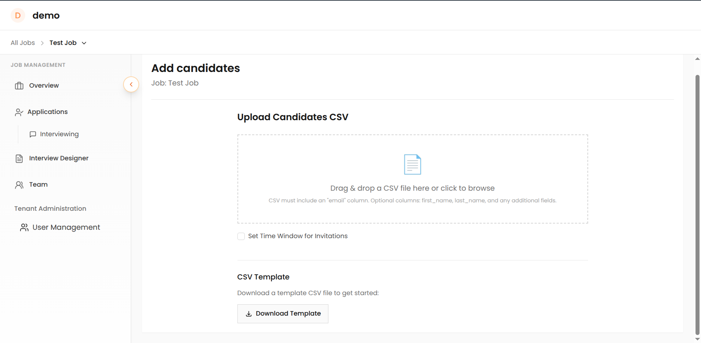
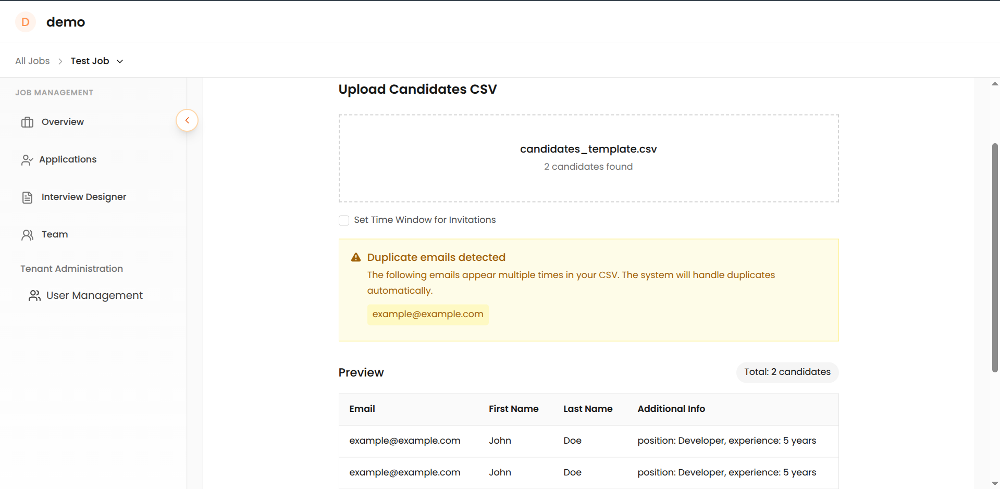
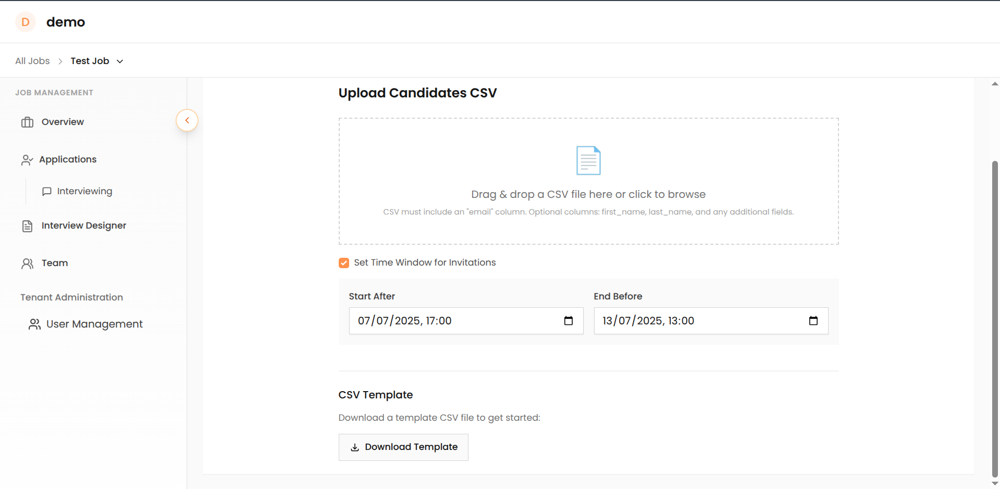

# How to Upload Candidates Using CSV

This guide explains how to invite candidates to interviews using the bulk invitation feature. You can efficiently invite multiple candidates by uploading a CSV (a spreadsheet file you can create in Excel or Google Sheets) with their information.

## Step-by-Step Process

### 1. Prepare Your CSV File

Your CSV file must contain this required column:

- `email` - Valid email address

Optional columns:

- `first_name` - Candidate's first name
- `last_name` - Candidate's last name

**Example CSV format:**
```csv
email,first_name,last_name
john.doe@example.com,John,Doe
jane.smith@example.com,Jane,Smith
alex.johnson@example.com,Alex,Johnson
```

### 2. Access the Invitation Manager

1. Go to your opening in the platform → Click on **Applications**
2. Click on the **"Invite Candidates"** button on the right side (or in the centre of the screen if inviting candidates for the first time)
3. A page/form will open for the invitation manager



*Click the "Invite Candidates" button to access the invitation manager*

### 3. Upload Your CSV File



You can upload your CSV file by:

- **Drag & Drop**: Drag your CSV file directly into the upload area
- **File Selection**: Click "Select File" to browse and choose your file

### 4. Data Validation & Processing

The system automatically validates your data:

- **Email Validation**: Checks for valid email format
- **Duplicate Detection**: Identifies duplicate email addresses
- **Data Completeness**: Verifies required fields are present



### 5. Configure & Download

1. **Preview**: Review candidate list and validation status
2. **Set Time Windows (Optional)**: Click the "Set Time Window for Invitations" checkbox to configure when interviews become available to candidates and when invitation links expire. Leave unchecked for immediate activation with default expiration.
    - **Start After**: Sets when candidates can begin accessing their interview links
    - **End Before**: Sets when invitation links expire and become inaccessible

    


3. **Process**: Click "Upload Candidate" to generate links
4. **Download**: Get CSV file with candidate application links for email distribution

!!! info "For Large Uploads"
    Process candidates in batches of 200-300 for optimal performance.

---

## Troubleshooting Guide

???+ question "Invalid CSV format error"
    **Solution**: Save file as CSV, not Excel (.xlsx). Ensure comma-separated values with proper headers.

??? question "Email column not found"
    **Solution**: Rename your email column to exactly `email` (lowercase) in the first row.

??? question "Invalid email format errors"
    **Common Issues**: Missing @ symbol, spaces, invalid domains (.con vs .com), special characters
    **Solution**: Review and correct flagged email addresses or remove invalid entries.

??? question "Duplicate email detected"
    **Meaning**: Same email appears multiple times. The system processes only the first occurrence.
    **Solution**: Remove duplicates before uploading.

??? question "Missing required fields"
    **Solution**: Check for empty cells in email, first_name, or last_name columns. Fill missing data or remove incomplete rows.

??? question "Upload/processing failures"
    **Solutions**:

    - Check internet connection
    - Split large files into smaller batches (100-500 candidates)
    - Close file in Excel/Sheets before uploading
    - Try different browser or refresh page
    - Test with smaller file first (5-10 candidates)

---

## Support and Additional Resources

Need help with candidate uploads? We're here to assist you.

**Email Support**: [support@recruit41.com](mailto:support@recruit41.com) - Get expert help with technical issues or questions about the upload process.

**Related Documentation:**

- [Recruiter Guide](index.md) - General recruiter guide and platform overview
