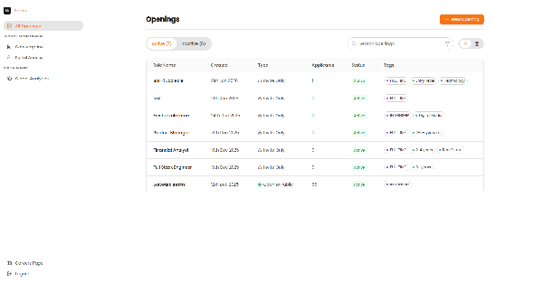
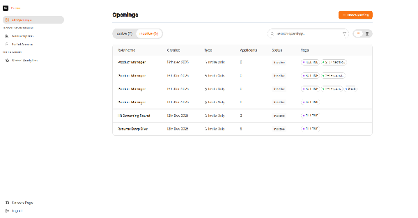
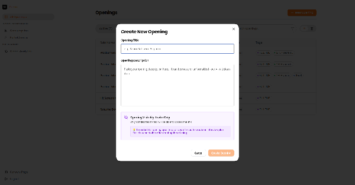
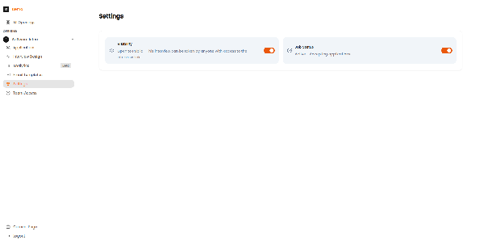

# Dashboard & Job Management

This guide covers the main dashboard and how to create and manage job openings in Recruit41.

---

## The Jobs List (Home Page)

When you log in, you land on the Jobs List page. This is your home base for all hiring activities.

*The Jobs List page showing active openings with job titles, application counts, and status indicators.*

| Area | Description |
| :--- | :--- |
| **Header** | Page title, search bar, and "+ New Opening" button |
| **Tab Bar** | Switch between "Active" and "Inactive" jobs |
| **Job Cards/Rows** | List of all your job openings |
| **Sidebar** | Navigation to other sections |

---

## Job Status Tabs

### Active Tab

Shows jobs that are:

- Currently accepting applications
- Visible to candidates (if set to Public)
- Ready for interviewing

### Inactive Tab

Shows jobs that are:

- Paused or closed
- Not accepting new applications
- Archived for record-keeping

*The Inactive tab shows closed or paused job postings that are no longer accepting applications.*

---

## Creating a New Job

### Step 1: Click the New Opening Button

From the Jobs List page, click the orange **"+ New Opening"** button in the top-right corner.

### Step 2: Fill Out the Job Details

*The Create New Opening modal with fields for job title, type, and description.*

| Field | Description | Required? |
| :--- | :--- | :--- |
| **Job Title** | The name of the position (e.g., "Senior Software Engineer") | Yes |
| **Hiring Manager** | Person responsible for this hire | Optional |
| **Department** | Team or business unit | Optional |
| **Job Description** | Details about the role, requirements, and responsibilities | Yes |

---

## Job Status: Active vs Inactive

### Changing Job Status

Go to the job's **Settings** page and use the toggles:

*The Settings page with Visibility and Job Status toggles to control job access.*

!!! tip "Best Practice"
    Set jobs to Inactive when you've filled the position or paused hiring. This keeps your Jobs List clean while preserving all candidate data.
