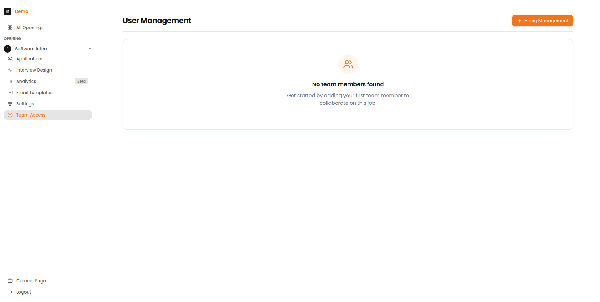

# FAQ & Best Practices

Common questions, team management tips, and security recommendations for Recruit41.

---

## Team Access Management

Control who can access specific job openings with job-level permissions.

*The Team Access page at the job level for managing who can access a specific job opening.*

!!! info "Job-Level vs Tenant-Level Access"
    - **Tenant-level** roles (Admin/User) control overall platform access
    - **Job-level** permissions restrict access to specific job openings

---

## Email Best Practices

Follow this cadence for candidate communication:

| Day | Action |
| :--- | :--- |
| Day 0 | Initial invitation |
| Day 3 | First reminder |
| Day 5 | Second reminder |
| Day 7 | Final reminder |

!!! tip "Response Rates"
    Candidates are most likely to respond within the first 48 hours. If no response after the final reminder, consider moving to the next candidate.

---

## Security Checklist

Use this checklist to ensure your interviews are secure:

- [ ] Proctoring enabled for high-stakes roles
- [ ] Camera required for all video interviews
- [ ] Pre-meeting checks enabled
- [ ] Browser restrictions for sensitive positions
- [ ] Session timeouts configured

---

## Frequently Asked Questions

??? question "How do I reset a candidate's interview?"
    Contact support at [support@recruit41.com](mailto:support@recruit41.com) with the candidate email and job title. Resets are typically processed within 24 hours.

??? question "Can I edit an interview plan after candidates have started?"
    Yes, but changes only apply to future candidates. Completed interviews retain their original plan configuration.

??? question "How long are interview recordings stored?"
    Recordings are stored for 12 months by default. Contact your account manager for extended retention options.

??? question "Can multiple team members review the same candidate?"
    Yes, all team members with job access can view candidate profiles and recordings simultaneously.

??? question "How do I export candidate data?"
    Use the CSV export button on the Applications page to download candidate information including scores and status.

---

## Support

For additional assistance:

- **Email:** [support@recruit41.com](mailto:support@recruit41.com)
- **In-app:** Click the help icon (bottom right)
