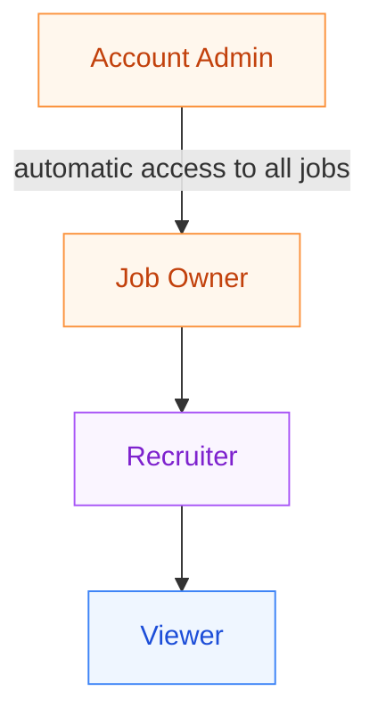
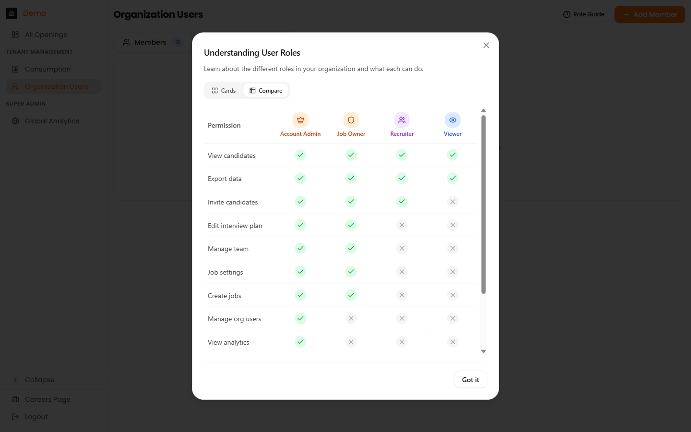
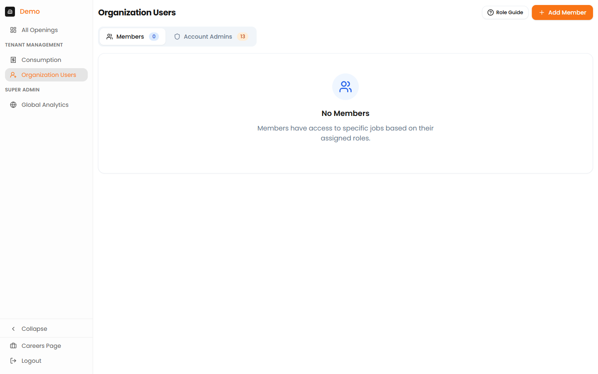

# Roles & Permissions

Recruit41 uses a layered role system to give you precise control over who can do what — at both the organisation level and the individual job level.

---

## Role Hierarchy at a Glance

Higher roles inherit every permission of the roles below them.

---

## Organisation-Level Role

### Account Admin

Full organisational control across the entire platform.

| Area | What they can do |
| :--- | :--- |
| **Jobs** | Create jobs, configure settings, manage all job data |
| **Users** | Add, remove, and change roles for any user |
| **Analytics** | View consumption insights and all reports |
| **Team** | Automatic access to every job — no invitation needed |

!!! info "Recommended for"
    HR administrators, heads of talent acquisition, platform owners.

---

## Job-Level Roles

You assign job-level roles per job. These control what each team member can do within that specific job.

### Job Owner

Full control over a specific job.

- Edit interview plans and scoring criteria
- Manage the job's team (add/remove members, change roles)
- Invite candidates and configure job settings
- View and export all candidate data
- Create new jobs (if they own at least one job)

!!! info "Recommended for"
    Hiring managers, senior recruiters responsible for the role.

### Recruiter

Day-to-day pipeline management.

- Invite candidates to interviews
- View candidate profiles and interview results
- Export candidate data
- View (but not edit) interview plans

!!! info "Recommended for"
    Recruiters, sourcers, coordinators managing candidate flow.

### Viewer

Read-only access for stakeholders who need visibility.

- View candidate profiles and interview results
- Export candidate data
- Read-only — inviting candidates, editing plans, and changing settings require a higher role

!!! info "Recommended for"
    Hiring team observers, department leads, external stakeholders.

---

## Permission Matrix

The table below shows exactly which permissions each role has.

| Permission | Account Admin | Job Owner | Recruiter | Viewer |
| :--- | :---: | :---: | :---: | :---: |
| View candidates | :material-check-circle:{ .green } | :material-check-circle:{ .green } | :material-check-circle:{ .green } | :material-check-circle:{ .green } |
| Export data | :material-check-circle:{ .green } | :material-check-circle:{ .green } | :material-check-circle:{ .green } | :material-check-circle:{ .green } |
| Invite candidates | :material-check-circle:{ .green } | :material-check-circle:{ .green } | :material-check-circle:{ .green } | :material-close-circle:{ .red } |
| Edit interview plan | :material-check-circle:{ .green } | :material-check-circle:{ .green } | :material-close-circle:{ .red } | :material-close-circle:{ .red } |
| Manage team | :material-check-circle:{ .green } | :material-check-circle:{ .green } | :material-close-circle:{ .red } | :material-close-circle:{ .red } |
| Job settings | :material-check-circle:{ .green } | :material-check-circle:{ .green } | :material-close-circle:{ .red } | :material-close-circle:{ .red } |
| Create jobs | :material-check-circle:{ .green } | :material-check-circle:{ .green } | :material-close-circle:{ .red } | :material-close-circle:{ .red } |
| Manage org users | :material-check-circle:{ .green } | :material-close-circle:{ .red } | :material-close-circle:{ .red } | :material-close-circle:{ .red } |
| View analytics | :material-check-circle:{ .green } | :material-close-circle:{ .red } | :material-close-circle:{ .red } | :material-close-circle:{ .red } |

!!! tip "In-app Role Guide"
    You can view this matrix at any time inside the platform by clicking the **Role Guide** button on the Organisation Users or Team Members page. It includes a cards view and a side-by-side comparison view.

---

## How Roles Work Together

### Organisation + Job levels

A user's access depends on two things: their **organisation role** and their **job-level role**.

| Organisation role | Job-level assignment needed? | Result |
| :--- | :--- | :--- |
| **Account Admin** | No — they get automatic full access to all jobs | Full control everywhere |
| **Member** (non-admin) | Yes — must be added to each job | Only sees jobs they are assigned to |

!!! warning "Key point"
    Members who are not assigned to any job will not see any job data. Always add team members to the openings they need to work on.

### Role Assignment Rules

Who can assign which roles:

| Your role | You can assign |
| :--- | :--- |
| **Account Admin** | Job Owner, Recruiter, Viewer |
| **Job Owner** | Recruiter, Viewer |
| **Recruiter** | — (cannot assign roles) |
| **Viewer** | — (cannot assign roles) |

---

## Using the Role Guide

The platform includes a built-in **Role Guide** to help your team understand roles at a glance.

### Accessing the Role Guide

1. Go to **Organisation Users** (for organisation roles) or a job's **Team Members** page (for job roles)
2. Click the **Role Guide** button in the top-right area

### Cards View

The default view shows each role as a card with its description and key permissions — ideal for quick reference.

*The Role Guide in cards view, showing all roles with their descriptions and permissions.*

### Compare View

Switch to the **Compare** tab to see a side-by-side permission matrix — useful for deciding which role to assign.

*The permission matrix view lets you compare roles side by side.*

### Job-Level Role Guide

When accessed from a job's **Team Members** page, the Role Guide shows only the three job-level roles (Job Owner, Recruiter, Viewer) — without the Account Admin, since it is an organisation-level role.

*The Role Guide in job context shows the three job-level roles with Quick Tips for team management.*

---

## Managing Organisation Users

Only Account Admins can manage organisation-level users.

*The Organisation Users page showing Members and Account Admins tabs, with the Role Guide and Add Member buttons.*

### Adding a User

1. Go to **Organisation Users** in the sidebar
2. Click **"Add User"**
3. Enter the user's email address
4. Select their organisation role (**Account Admin** or **Member**)
5. Click **"Save"**

### Changing a User's Organisation Role

1. Go to **Organisation Users**
2. Find the user in the list
3. Click on their current role
4. Select the new role
5. Confirm the change

!!! warning
    Be careful when removing Account Admin access — ensure at least one Account Admin remains on the account.

---

## Managing Job Team Members

Job Owners and Account Admins can manage a job's team.

*The Team Members page for a specific job, with the Role Guide and Add Team Member buttons.*

### Adding a Team Member to a Job

1. Open the job and go to the **Team Members** tab
2. Click **"Add Member"**
3. Search for the user by name or email
4. Select their job role (**Job Owner**, **Recruiter**, or **Viewer**)
5. Click **"Add"**

### Changing a Team Member's Job Role

1. Open the job's **Team Members** tab
2. Find the team member
3. Click on their current role to change it
4. Select the new role

### Removing a Team Member

1. Open the job's **Team Members** tab
2. Find the team member
3. Click **"Remove"**
4. Confirm the action

---

## Quick Tips

!!! tip "Best practices for role assignment"
    - **Account Admins** get automatic access to all jobs — no need to add them individually to each job.
    - **Members** only see jobs they are explicitly assigned to.
    - When in doubt, start with **Recruiter** access — you can always upgrade later.
    - Only **Job Owners** and **Account Admins** can add or remove team members from a job.

---

## Migrating from the Previous Role System

If your account was set up before the current role system, your existing roles have been automatically migrated:

| Old role | New role |
| :--- | :--- |
| Tenant Admin | Account Admin |
| Tenant User | Member (with existing job assignments preserved) |

No action is required — all existing permissions and job access have been preserved.

---

## FAQ

??? question "What is the difference between Account Admin and Job Owner?"
    **Account Admin** is an organisation-level role with access to all jobs and user management. **Job Owner** is a job-level role with full control over a specific job but no organisation-wide privileges.

??? question "Can a Recruiter create jobs?"
    A Recruiter gains the ability to create new jobs once they are also a **Job Owner** on at least one job.

??? question "What happens if I don't assign someone to a job?"
    Non-admin users who are not assigned to a job will not see it. Only Account Admins have automatic access to every job.

??? question "Can I have multiple Account Admins?"
    Yes. You can have as many Account Admins as needed, but we recommend limiting admin access to those who truly need it (see the [Access Levels](access-levels.md) guide).

??? question "What happens when someone leaves the company?"
    Remove their access immediately via **Organisation Users**. Their historical actions remain in the audit log for compliance.
