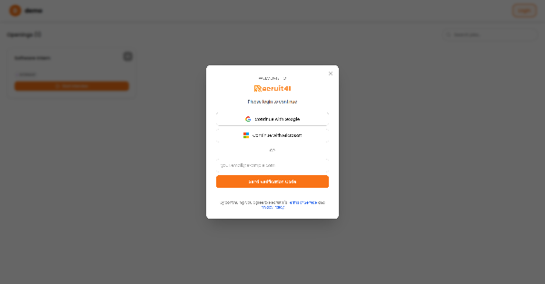
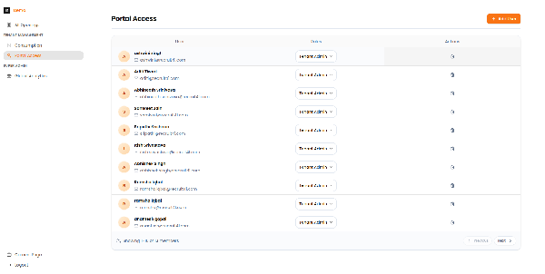

# Getting Started

Welcome to the Recruit41 Recruiter Guide! This comprehensive guide will help you effectively use the Recruit41 platform to streamline your hiring process.

## What is Recruit41?

Recruit41 is an AI-powered interview platform that helps you:

- **Post job openings** and make them available to candidates
- **Design custom interviews** with different question types (Q&A, coding challenges, case studies)
- **Invite candidates** to take interviews at their convenience
- **Review candidate performance** with AI-generated feedback and scores
- **Monitor for potential issues** during interviews (like someone reading from notes)
- **Track analytics** to understand your hiring pipeline

---

## Accessing the Platform

### Step 1: Go to the Platform

Open your web browser and go to your company's Recruit41 URL (for example: `https://yourcompany.recruit41.com`).

*The login page shows the welcome screen with multiple authentication options including Google, Microsoft, and Email Code.*

### Step 2: Choose Your Login Method

You have three ways to log in:

=== "Google"

    1. Click the **"Sign in with Google"** button
    2. Select your Google account
    3. You'll be automatically logged in

=== "Microsoft"

    1. Click the **"Sign in with Microsoft"** button
    2. Enter your Microsoft credentials
    3. You'll be automatically logged in

=== "Email Code"

    1. Enter your email address in the email field
    2. Click **"Send Verification Code"**
    3. Check your email for a 6-digit code
    4. Enter the code in the verification field
    5. Click **"Verify & Continue"**

---

## User Access Golden Rule

!!! tip "Key Principle"
    Every team member should have the minimum access level required for their role.

| Benefit | Description |
| :--- | :--- |
| **Data Security** | Sensitive candidate information stays protected |
| **Audit Trail** | Clear accountability for who made changes |
| **Prevent Accidents** | Avoid unintended modifications to interview configs |
| **Compliance** | Meet data protection requirements (GDPR, SOC2) |

---

## Role-Based Access Control

### Tenant Admin

Full access to the platform, including:

- Create and manage job openings
- Design interview plans
- Add/remove team members
- Access billing information
- Configure all settings

!!! info "Recommended for"
    Hiring managers, senior recruiters, HR administrators

### Tenant User

Limited access for day-to-day operations:

- View job listings and candidates
- Send candidate communications
- View analytics and reports
- Review interview results

!!! info "Recommended for"
    Recruiters, coordinators, hiring team members

---

## Adding Team Members

### Step 1: Navigate to Portal Access

Click **"Portal Access"** in the sidebar under Tenant Management.

*The Portal Access page displays all team members with their roles and allows adding new users.*

---

## Quick Links

- [Dashboard & Jobs](dashboard.md) - Navigate the platform and manage jobs
- [Interview Planner](interview-planner.md) - Design custom interview plans
- [Candidate Management](candidate-management.md) - Manage applications and candidates
- [Reports & Analytics](reports-analytics.md) - Track your hiring pipeline
- [Quick Reference](quick-reference.md) - Common actions and score interpretation

## Support

For additional assistance, please contact our support team at [support@recruit41.com](mailto:support@recruit41.com).
