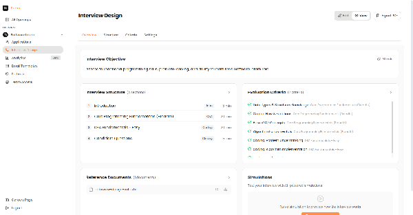
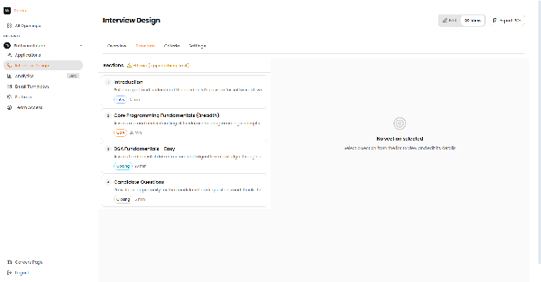
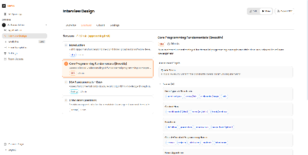
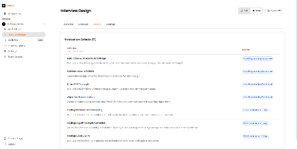
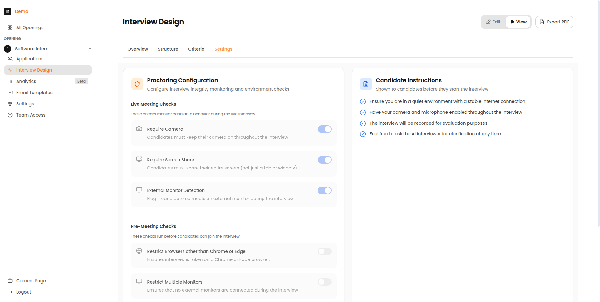

# Interview Planner

The Interview Planner is where you design how the AI should conduct interviews. This guide walks you through the five-step design process.

---

## What is an Interview Plan?

An Interview Plan is your blueprint for how the AI should conduct interviews. It includes:

- **Interview Structure** - The sections and order of the interview
- **Questions and Topics** - What the AI should ask about
- **Evaluation Criteria** - How candidates should be scored
- **Settings** - Proctoring rules and candidate instructions

---

## Step 1: Overview & Objectives

Start by defining the high-level objectives and duration of your interview.

*The Interview Design Overview tab showing the interview objective, total duration, and structure summary.*

!!! tip "Setting Objectives"
    Be specific about what you want to evaluate. Clear objectives help the AI ask more relevant follow-up questions.

---

## Step 2: Module Structure

Design the flow of your interview by adding and configuring sections.

*The Structure tab showing all interview sections with their types and durations.*

### Section Details Panel

Click on any section to view and edit its configuration:

*The section details panel showing topics, subtopics, and evaluation criteria for the selected section.*

### Section Types

| Type | Description | Use Case |
| :--- | :--- | :--- |
| **Q&A** | Conversational questions | Behavioral, situational interviews |
| **Coding** | Live coding challenges | Technical assessments |
| **Case Study** | Problem-solving scenarios | Analytical roles |

---

## Step 3: Evaluation Criteria

Define how candidates should be scored across different competencies.

*The Criteria tab showing all evaluation criteria with their descriptions and source sections.*

!!! info "Scoring"
    Each criterion is scored on a 1-5 scale. The AI uses these criteria to generate structured feedback and overall recommendations.

---

## Step 4: Proctoring Settings

Configure security and monitoring options for your interviews.

*The Settings tab with Proctoring Configuration options including camera, screen share, and monitor detection.*

| Setting | Default | Description |
| :--- | :--- | :--- |
| **Require Camera** | ON | Candidates must keep camera on |
| **Require Screen Share** | OFF | Candidates must share entire screen |
| **External Monitor Detection** | OFF | Flag if candidate connects extra display |

!!! warning "For High-Stakes Roles"
    Enable all proctoring options for senior positions or roles with access to sensitive information.

---

## Best Practices

1. **Keep sections focused** - Each section should evaluate 2-3 related competencies
2. **Balance duration** - Allocate more time to critical skills
3. **Test your plan** - Run through the interview yourself before going live
4. **Iterate based on data** - Review analytics to refine your approach
