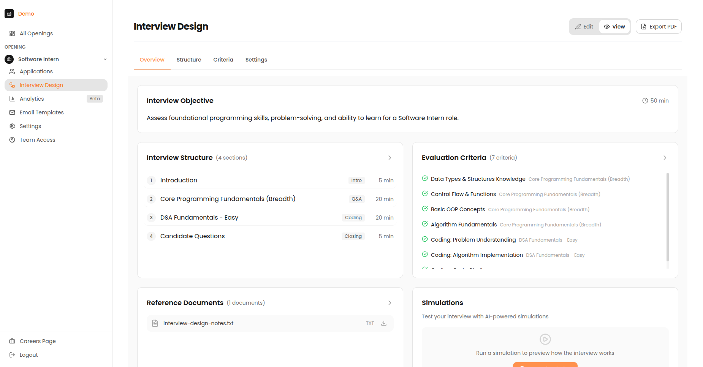
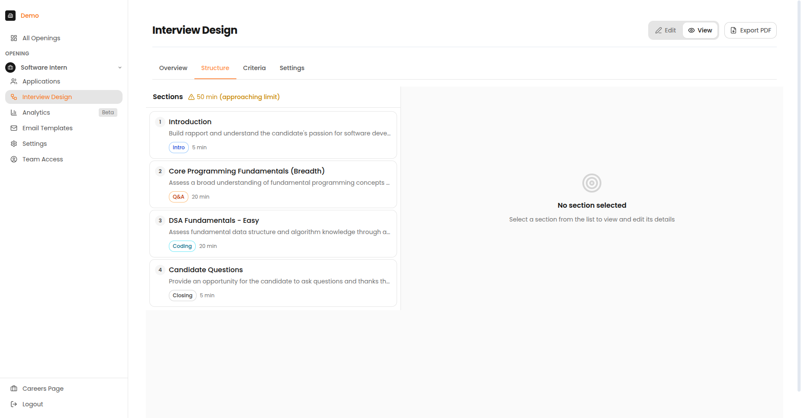

# Job Management

This section covers the dashboard overview, creating jobs, designing interviews, and managing job visibility and status.

---

## Dashboard Overview

### The Jobs List (Home Page)

When you log in, you land on the Jobs List page. This is your home base for all hiring activities.

*The Jobs List page showing active openings with job titles, visibility, applicant counts, and status indicators.*

#### What You See

| Area | Description |
| :--- | :--- |
| **Header** | Page title, search bar, and "+ New Opening" button |
| **Tab Bar** | Switch between "Active" and "Inactive" jobs |
| **Job Cards/Rows** | List of all your job openings |
| **Sidebar** | Navigation to other sections |

### Job Status Tabs

#### Active Tab

Shows jobs that are:

- Currently accepting applications
- Visible to candidates (if set to Public)
- Ready for interviewing

#### Inactive Tab

Shows jobs that are:

- Paused or closed
- Not accepting new applications
- Archived for record-keeping

*The Inactive tab shows closed or paused job postings.*

### Understanding Job Cards

| Element | Description |
| :--- | :--- |
| **Job Title** | The name of the position |
| **Application Count** | Number of candidates who have applied |
| **Status Badges** | Active/Inactive, Public/Private indicators |
| **Created Date** | When the job was created |
| **Last Activity** | Most recent candidate activity |

*Card view showing jobs with visual status indicators.*

### Sidebar Navigation

#### Global Navigation

| Item | Where It Goes |
| :--- | :--- |
| **All Openings** | Back to the Jobs List |
| **Consumption** | Usage and billing (Admin only) |
| **Portal Access** | Team management (Admin only) |
| **Careers Page** | Your public job listings |

#### Job-Specific Navigation

When you select a job, additional options appear:

| Item | What It's For |
| :--- | :--- |
| **Applications** | See all candidates for this job |
| **Interview Design** | Create/edit the interview plan |
| **Analytics** | Performance data and statistics |
| **Email Templates** | Manage automated emails |
| **Settings** | Job visibility and status |
| **Team Access** | Control who can access this job |
| **Add Candidates** | Invite candidates via CSV |

### Careers Page

The Careers Page is your public-facing job board where candidates can browse and apply to open positions.

*The public Careers Page showing available job openings.*

---

## Job Creation

### Creating a New Job

#### Step 1: Click the New Opening Button

From the Jobs List page, click the orange **"+ New Opening"** button in the top-right corner.

#### Step 2: Fill Out the Job Details

| Field | Description | Required? |
| :--- | :--- | :--- |
| **Job Title** | The name of the position (e.g., "Senior Software Engineer") | Yes |
| **Hiring Manager** | Person responsible for this hire | Optional |
| **Department** | Team or business unit | Optional |
| **Job Description** | Details about the role, requirements, and responsibilities | Yes |

!!! tip "Tips for the Description"
    - Don't worry about formatting - the AI will clean up messy text
    - Include key requirements and qualifications
    - Add information about the role's responsibilities
    - Mention any specific skills or experience needed

#### Step 3: Set Job Parameters

| Field | Options | Notes |
| :--- | :--- | :--- |
| **Location** | City, Remote, Hybrid | Be specific for candidate filtering |
| **Job Type** | Full-time, Part-time, Contract, Internship | Affects expectations |
| **Experience Level** | Entry, Mid, Senior, Lead, Executive | Helps AI calibrate |

#### Step 4: Create the Job

Click the **"Create"** button. The job is created with "Invite Only" visibility by default.

---

## Five-Step Interview Design

An Interview Plan is your blueprint for how the AI should conduct interviews. It includes the interview structure, questions and topics, evaluation criteria, and proctoring settings.

!!! warning "Important"
    You must create an Interview Plan before you can invite candidates or make a job public.

### Overview & Objectives

The Interview Objective tells the AI what to assess. This is **critical** for relevant question generation.

*The Interview Design Overview showing the objective, structure summary, and evaluation criteria.*

#### Writing a Good Objective

**Do:**

- Be specific about skills to assess
- List 3-5 key competencies
- Include both technical AND soft skills
- Mention culture fit elements if relevant

**Don't:**

- Use vague terms like "good fit"
- Write long paragraphs
- Focus only on technical abilities

!!! success "Good Objective Example"
    *"Assess SQL proficiency, data visualization skills, communication clarity, and problem-solving approach for a customer-facing analytics role."*

!!! failure "Poor Objective Example"
    *"Find a good data analyst who can do the job well."*

---

### Module Structure

#### The Three-Panel Layout

| Panel | Position | Purpose |
| :--- | :--- | :--- |
| **Section Library** | Left | Available sections you can add |
| **Plan Canvas** | Center | Your interview structure |
| **Property Inspector** | Right | Edit the selected section |

*The Structure tab showing interview sections with their types and durations.*

#### Typical Interview Stages

| Stage | Purpose | Duration |
| :--- | :--- | :--- |
| **Introduction** | Warm up, explain process | 2-5 min |
| **Background Q&A** | Learn about experience | 10-15 min |
| **Technical Questions** | Assess domain knowledge | 10-20 min |
| **Coding Challenge** | Evaluate problem-solving | 20-30 min |
| **Candidate Q&A** | Answer their questions | 5 min |
| **Closing** | Wrap up, next steps | 2-3 min |

#### Section Types Available

| Module Type | Best For | Features |
| :--- | :--- | :--- |
| **Multiple Choice Q&A** | Knowledge screening | Auto-graded, quick |
| **Code Pad** | Technical assessment | Live coding, syntax highlighting |
| **Video Response** | Behavioral questions | Async, reviewable |
| **Async Task** | Take-home assignments | Deadline-based |
| **Case Study** | Problem-solving | Document analysis |
| **Live Deep Dive** | In-depth discussion | Real-time interaction |

!!! info "Duration Limit"
    Total interview cannot exceed **60 minutes**.

---

### Evaluation Criteria

#### Criteria Types

| Type | Badge | Description |
| :--- | :--- | :--- |
| **Interview-wide** | Purple | Applies to entire interview |
| **Section-specific** | Blue | Applies only to one section |

#### Scoring Scales

| Scale Type | When to Use | Example |
| :--- | :--- | :--- |
| **1-5 Scale** | Nuanced assessment | 1=Poor, 3=Meets, 5=Exceeds |
| **Pass/Fail** | Binary requirements | Must-have qualifications |
| **Percentage** | Quantitative tasks | Code test accuracy |
| **Rubric** | Detailed evaluation | Multi-level descriptions |

---

### Proctoring Settings

#### Live Meeting Checks

| Setting | Default | Description |
| :--- | :--- | :--- |
| **Require Camera** | ON | Candidates must keep camera on |
| **Require Screen Share** | OFF | Candidates must share entire screen |
| **External Monitor Detection** | OFF | Flag if candidate connects extra display |

#### Pre-Meeting Checks

| Check | What It Verifies |
| :--- | :--- |
| **Browser** | Supported browser (Chrome recommended) |
| **Camera** | Camera is working |
| **Microphone** | Mic is working |
| **Network** | Stable internet connection |

#### Proctoring Guidelines by Role Type

| Role Type | Recommended Settings |
| :--- | :--- |
| Entry-level | Camera only |
| Mid-level | Camera + Screen share |
| Senior/Leadership | Camera + Screen share + Monitor detection |
| High-security | All options enabled |

---

### Run Simulation

!!! danger "Never launch without testing!"
    Always run a simulation before inviting real candidates.

#### What to Check

| Check | What to Look For |
| :--- | :--- |
| **Timer** | Countdown works, warnings appear |
| **Navigation** | Next/back buttons work |
| **Questions** | Text renders correctly |
| **Attachments** | Images load, files downloadable |
| **Code Editor** | Syntax highlighting works |
| **Video** | Camera prompt appears |
| **Submission** | Final submit works |

---

## Visibility & Status Toggles

### Job Status: Active vs Inactive

#### Active Jobs

- Appear in the "Active" tab
- Can receive new applications
- Candidates can take interviews
- Visible to candidates (if set to Public)

#### Inactive Jobs

- Appear in the "Inactive" tab
- Cannot receive new applications
- Existing interviews remain accessible
- Hidden from public view

*The Inactive tab shows closed or paused job postings.*

#### Changing Job Status

1. Go to the job's **Settings** page
2. Find the **Job Status** toggle
3. Switch between Active and Inactive

---

### Job Visibility: Public vs Private

#### Invite Only (Private) - Default

- Only candidates you invite can access the job
- The job doesn't appear on your public careers page
- You must send candidates a direct link or invitation email
- Best for: Confidential roles, referrals, targeted hiring

#### Public

- The job appears on your public careers page
- Anyone with the link can apply
- Great for high-volume hiring
- Best for: Open positions, campus recruiting, mass hiring

!!! warning "Important"
    You must create an interview plan before you can make a job public.

### Common Visibility Scenarios

| Scenario | Visibility | Status |
| :--- | :--- | :--- |
| Open public hiring | Public | Active |
| Referral-only position | Private | Active |
| Temporarily paused hiring | Any | Inactive |
| Filled position (keep for records) | Private | Inactive |
| Confidential executive search | Private | Active |
