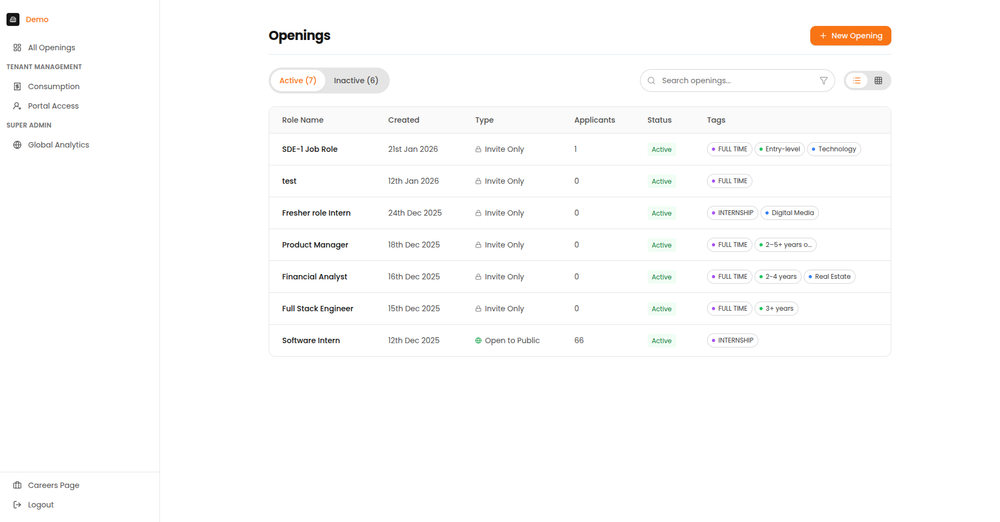
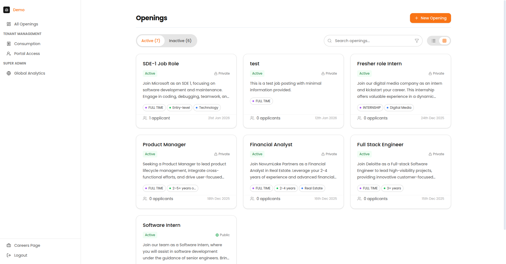

# How to Create a New Opening

Learn how to create new openings and navigate the jobs dashboard.

---

## The Openings List (Home Page)

When you log in, you land on the Openings List page. This is your home base for all hiring activities.

*The Openings List page showing active openings with titles, visibility, applicant counts, and status indicators.*

### What You See

| Area | Description |
| :--- | :--- |
| **Header** | Page title, search bar, and "+ New Opening" button |
| **Tab Bar** | Switch between "Active" and "Inactive" openings |
| **Job Cards/Rows** | List of all your openings |
| **Sidebar** | Navigation to other sections |

### Understanding Job Cards

| Element | Description |
| :--- | :--- |
| **Job Title** | The name of the position |
| **Application Count** | Number of candidates who have applied |
| **Status Badges** | Active/Inactive, Public/Private indicators |
| **Created Date** | When the opening was created |
| **Last Activity** | Most recent candidate activity |

*Card view showing openings with visual status indicators.*

---

## Creating a New Opening

### Step 1: Click the New Opening Button

From the Openings List page, click the orange **"+ New Opening"** button in the top-right corner.

### Step 2: Fill Out the Job Details

| Field | Description | Required? |
| :--- | :--- | :--- |
| **Job Title** | The name of the position (e.g., "Senior Software Engineer") | Yes |
| **Hiring Manager** | Person responsible for this hire | Optional |
| **Department** | Team or business unit | Optional |
| **Job Description** | Details about the role, requirements, and responsibilities | Yes |

!!! tip "Tips for the Description"
    - The AI will clean up formatting, so focus on content
    - Include key requirements and qualifications
    - Add information about the role's responsibilities
    - Mention any specific skills or experience needed

### Step 3: Set Job Parameters

| Field | Options | Notes |
| :--- | :--- | :--- |
| **Location** | City, Remote, Hybrid | Be specific for candidate filtering |
| **Job Type** | Full-time, Part-time, Contract, Internship | Affects expectations |
| **Experience Level** | Entry, Mid, Senior, Lead, Executive | Helps AI calibrate |

### Step 4: Create the Opening

Click the **"Create"** button. Your new opening is set to "Invite Only" by default.

---

## Sidebar Navigation

### Global Navigation

| Item | Where It Goes |
| :--- | :--- |
| **All Openings** | Back to the Openings List |
| **Consumption** | Usage and credits (Account Admin only) |
| **Organisation Users** | Team management (Account Admin only) |
| **Careers Page** | Your public job listings |

### Job-Specific Navigation

When you select an opening, additional options appear:

| Item | What It's For |
| :--- | :--- |
| **Applications** | See all candidates for this opening |
| **Interview Design** | Create/edit the interview plan |
| **Analytics** | Performance data and statistics |
| **Email Templates** | Manage automated emails |
| **Settings** | Opening visibility and status |
| **Team Members** | Control who can access this opening |

---

## Careers Page

The Careers Page is your public-facing job board where candidates can browse and apply to open positions.

*The public Careers Page showing available openings.*

---

## Next Steps

After creating an opening:

1. [Design your interview](interview-design.md)
2. [Configure visibility settings](visibility-and-status.md)
3. [Add candidates](../candidate-management/adding-candidates.md)
