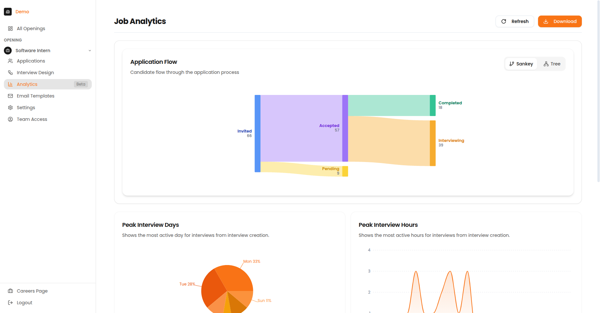

# Reports & Analytics

Track your hiring pipeline and understand interview performance with Recruit41's analytics tools.

---

## Consumption Insights

Monitor your platform usage and interview consumption.

| Metric | Description |
| :--- | :--- |
| **Total Interviews** | Number conducted |
| **Credits Used** | Credits consumed |
| **Remaining Balance** | Credits available |
| **Usage Trend** | Chart over time |

---

## Job Analytics

View detailed analytics for each job opening to understand your hiring funnel.

*The Job Analytics page showing Application Flow, Peak Interview Days, Peak Interview Hours, and Score Distribution.*

### Summary Cards

| Card | What It Shows |
| :--- | :--- |
| **Total Candidates** | Number of applications |
| **Completion Rate** | % who finished |
| **Average Score** | Mean AI rating |
| **Top Performers** | Candidates scoring 4+ |

---

## Sankey Diagram (Drop-Off Analysis)

The Sankey diagram visualizes candidate flow through your pipeline, showing where candidates drop off and conversion rates between stages.

| Element | Meaning |
| :--- | :--- |
| **Thick flows** | More candidates took this path |
| **Thin flows** | Fewer candidates |
| **Red/Orange** | Drop-off points |
| **Green** | Successful completions |

!!! tip "Identifying Issues"
    If you see a large drop-off at a specific stage, investigate why. Common causes include:

    - Interview too long
    - Technical difficulties
    - Poor candidate experience
    - Unclear instructions

---

## Score Distribution

Understand how candidates are performing across your interviews.

### Percentile Rankings

| Percentile | Meaning |
| :--- | :--- |
| **Top 10%** | Exceptional candidates |
| **Top 25%** | Strong performers |
| **Top 50%** | Above average |
| **Bottom 50%** | Below average |

---

## Peak Activity Tracking

The activity heatmap shows when candidates take interviews by day of week and hour of day.

### How to Use This Data

- **Optimize reminder timing** - Send reminders when candidates are most active
- **Set better deadlines** - Align deadlines with high-activity periods
- **Plan review sessions** - Schedule reviews when new completions are likely

---

## Using Analytics Effectively

| Goal | What to Monitor |
| :--- | :--- |
| **Improve completion rates** | Drop-off points in Sankey diagram |
| **Find top talent faster** | Score distribution, percentile rankings |
| **Optimize timing** | Peak activity heatmap |
| **Track ROI** | Consumption insights, credits used |

### Best Practices

1. **Monitor funnel drop-off** - If many candidates drop out at a specific stage, investigate why
2. **Track score trends** - Consistently low scores may indicate sourcing issues
3. **Optimize timing** - Schedule reviews during your peak activity periods
4. **Plan capacity** - Use consumption data to forecast hiring needs
