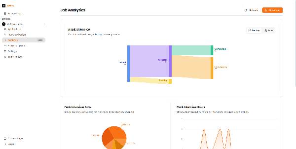
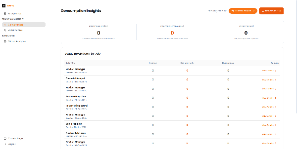

# Reports & Analytics

Track your hiring pipeline and understand interview performance with Recruit41's analytics tools.

---

## Job Analytics

View detailed analytics for each job opening to understand your hiring funnel.

*The Job Analytics page showing Application Flow (Sankey diagram), Peak Interview Days, Peak Interview Hours, and Score Distribution.*

### Available Metrics

| Metric | Description |
| :--- | :--- |
| **Application Flow** | Sankey diagram showing candidate progression through stages |
| **Peak Interview Days** | Which days of the week have the most interviews |
| **Peak Interview Hours** | Which hours see the most interview activity |
| **Score Distribution** | Histogram of candidate scores |

!!! tip "Optimizing Scheduling"
    Use peak days and hours data to better plan your review schedule and ensure timely candidate feedback.

---

## Consumption Insights

Monitor your platform usage and interview consumption.

*The Consumption Insights page showing interviews invited, consumed, jobs created, and usage breakdown by job.*

### Key Metrics

| Metric | Description |
| :--- | :--- |
| **Interviews Invited** | Total number of candidates invited |
| **Interviews Consumed** | Completed interviews (billable) |
| **Jobs Created** | Number of active job openings |
| **Usage by Job** | Breakdown of consumption per job |

---

## Using Analytics Effectively

1. **Monitor funnel drop-off** - If many candidates drop out at a specific stage, investigate why
2. **Track score trends** - Consistently low scores may indicate sourcing issues
3. **Optimize timing** - Schedule reviews during your peak activity periods
4. **Plan capacity** - Use consumption data to forecast hiring needs
